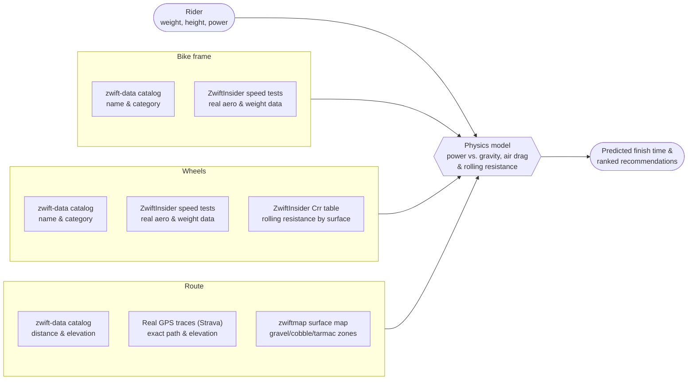

# How the Bike & Wheel Recommendation Physics Works

## In one sentence

For a given route and a rider's real weight, height and power, the app predicts how long each frame + wheel combo would take to finish — using the same forces that govern real cycling (gravity, air drag, rolling resistance), calibrated wherever possible against real Zwift speed-test data rather than guesswork.

## What goes into a prediction

Every prediction combines four things:

- **The rider** — weight, height, and sustained power (in watts, or watts/kg)
- **The bike frame** — how aerodynamic it is, and how much it weighs
- **The wheels** — aerodynamics, weight, and how much rolling resistance they generate on different surfaces
- **The route** — how hilly it is, how long it is, and what it's paved with (tarmac, gravel, cobbles, dirt, grass, snow, wood)

## Where the numbers actually come from

This is the part that matters most for trustworthiness — every number is either **real measured data** or a **clearly-flagged estimate**, never silently invented:

| Source | What it provides |
|---|---|
| **A community-maintained Zwift data catalog** (`zwift-data`, third-party, MIT-licensed) | The list of every bike frame, wheel, and route in the game — names, categories, distances, elevation. Some of this is pulled automatically from Zwift's own public API; the rest is manually collected by the community from sources like Strava, What's on Zwift, and ZwiftPower. Not an official Zwift product, but a widely-used, actively-maintained reference. |
| **ZwiftInsider real-world speed tests** | ZwiftInsider — an independent Zwift news/testing site — runs a "bot" at a fixed weight/height/power around a flat course and a climb course, for every bike and wheel, and publishes exactly how many seconds it saves or costs per hour versus a baseline. This is the closest thing to ground truth available. |
| **ZwiftInsider's rolling-resistance table** | Zwift's own official (not estimated) rolling-resistance values for every wheel type on every surface. |
| **Real GPS route traces** (via Strava) | The exact path a rider's bike actually follows around each route, and the real elevation change along it, metre by metre. |
| **zwiftmap's surface map data** (community project, MIT-licensed) | zwiftmap provides polygon maps of which areas of each Zwift world are gravel, cobbles, dirt, grass, wood, or snow (described by this app's own third-party notices as "hand-mapped," though that's not something independently verified against zwiftmap's own methodology). Overlaying a route's real GPS trace onto these maps gives the route's real, exact surface composition — precisely where it changes from tarmac to gravel and back, not just an overall percentage. |
| **A published sports-science formula** (Faria et al., 2005) | Estimates a rider's own frontal area (and therefore air drag) from their height and weight — the same formula used by comparable Zwift tools. |

When real test data exists for a bike or wheel, it's labelled **"measured."** When it doesn't yet exist, the app falls back to a reasonable estimate (based on the bike's real-world reputation, or the wheel's rim depth) and labels it **"estimated."** This distinction is visible in the app so nobody mistakes a guess for a fact.

## How the calculation actually works

Think of it as a tug-of-war. A rider's pedalling power has to overcome three things at once:

1. **Gravity** — pulls harder the steeper the climb (and helps on descents)
2. **Air resistance** — grows very quickly with speed; the biggest factor on flat, fast routes
3. **Rolling resistance** — friction between tyres and road surface; barely matters on tarmac, matters a lot on gravel and cobbles

A small amount of power (about 2.5%) is also lost in the drivetrain, exactly as it is on a real bike.

The bike frame and wheels affect this tug-of-war in two ways: they add **weight** (making gravity fight harder on climbs) and they add or remove **aerodynamic drag** (making air resistance fight harder or softer). Both effects come straight from the ZwiftInsider measurements described above, wherever they exist.

The app actually runs this calculation two different ways, depending on the situation:

- **A quick estimate**, used to instantly rank dozens of combos against each other. It treats the whole route as one average slope, so it's fast but approximate.
- **A full simulation**, used for the detailed result page. It walks through the route in tiny slices (every quarter-second), looking up the *real* gradient and *real* surface at that exact point, so climbs, descents, and surface changes are all accounted for individually rather than averaged away.

Both use the exact same underlying force calculation, so they never disagree about which combo is faster — one is just a cheaper approximation of the other.

### Acceleration, not just steady speeds

Real riding isn't one constant speed — you slow down grinding up a steepening gradient and speed back up on the way down, and it takes a moment to get back up to speed after a corner or a change in slope. The full simulation models this directly: at each tiny time-step it works out the *net* force (pedalling power minus gravity, air drag and rolling resistance) and uses that to work out how much the rider is speeding up or slowing down right now, before moving on to the next slice of road. A route with several short, punchy ramps is treated differently from one long steady gradient with the same total elevation gain — even though both would look identical to the quick estimate.

The quick estimate skips this — it assumes the rider is already at one steady, unchanging speed for the whole ride, which is exactly why it's only used for fast ranking, never for the detailed result.

### How often the terrain is checked

The full simulation re-checks the current gradient and surface every quarter of a second of simulated riding time — many times over even a short climb — so speed changes track the real shape of the road closely, rather than being averaged into one number for the whole route.

The gradient and surface data itself isn't evenly sampled every few metres, though. Long, straight, flat stretches are deliberately reduced to just a couple of points (there's nothing changing to record), while every real climb, descent, and rolling section keeps its full detail — the model interpolates smoothly between whichever points exist. Surface changes (say, where tarmac turns to gravel) are recorded at their exact real position, so rolling resistance switches right at that point rather than at some rounded-off marker.

For routes that don't have this real trace data yet, the model falls back to a simpler synthetic shape (built from any known named climbs, or a generic rolling profile). Its assumed surface still isn't a blind guess, though: it checks zwiftmap's coarser, world-level surface data first — if the route's world is known to contain gravel or cobbles anywhere, the route is flagged as **unverified** rather than confidently treated as 100% paved.

## Diagram

## How this scales to new bikes and wheels

Zwift regularly releases new bikes and wheels. When that happens:

1. The new item shows up in the app automatically. An automated bot watches for new versions of the data catalog and opens a pull request as soon as one is published; once that pull request is merged, the app's existing build pipeline automatically rebuilds and redeploys the live site — no manual deployment step needed beyond reviewing and merging that update.
2. Until real speed-test data exists for it, it's scored using a reasonable estimate (based on its real-world category — aero, climbing, endurance, etc.) and clearly marked **"estimated."**
3. Once ZwiftInsider — the independent site that runs these bot tests — publishes real numbers for it, that data gets added to the app's reference tables by hand, and the item then upgrades to **"measured"** the next time the site rebuilds — with no other changes needed anywhere else in the app.

So the app never blocks on new gear appearing, and its accuracy for that gear improves the moment real data becomes available, without a redesign.

## How this scales to new routes

New Zwift routes work the same way, but with one extra manual step:

1. The route appears automatically (name, distance, elevation) as soon as the catalog update is merged and the site rebuilds — the same automatic pipeline described above.
2. Its exact surface breakdown (how much gravel or cobblestone it contains) and real elevation shape need a separate step that isn't part of the automatic rebuild: periodically replaying the route's real GPS trace (via Strava) against zwiftmap's surface data. This is run by hand, not on a schedule — as new routes appear, or to catch real-world road changes. Until it's been run for a given route, that route uses the coarser fallback described above.
3. Once that trace is processed and committed, the route gets the same fully accurate, metre-by-metre treatment as every other route on the next rebuild — automatically, without touching the ranking or physics logic at all.

In both cases, the design goal is the same: **new content should never be blocked from appearing, but it should also never silently pretend to be more accurate than it is** — the app always shows which numbers are real and which are best-effort estimates.
