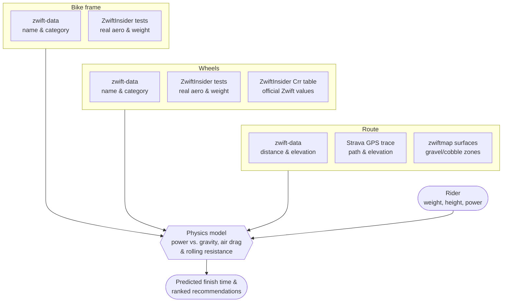

# How the Bike & Wheel Recommendation Physics Works

## In one sentence

For a given route and a rider's real weight, height and power, the app predicts how long each frame + wheel combo would take to finish — using the same forces that govern real cycling (gravity, air drag, rolling resistance), calibrated wherever possible against real Zwift speed-test data rather than guesswork.

## What goes into a prediction

Every prediction combines four things:

- **The rider** — weight, height, and sustained power (in watts, or watts/kg)
- **The bike frame** — how aerodynamic it is, how much it weighs, and how far it has been upgraded
- **The wheels** — aerodynamics, weight, and how much rolling resistance they generate on different surfaces
- **The route** — how hilly it is, how long it is, and what it's paved with (tarmac, gravel, cobbles, dirt, grass, snow, wood)

## Where the numbers actually come from

This is the part that matters most for trustworthiness — every number is either **real measured data** or a **clearly-flagged estimate**, never silently invented:

| Source | What it provides |
|---|---|
| **A community-maintained Zwift data catalog** (`zwift-data`, third-party, MIT-licensed) | The list of every bike frame, wheel, and route in the game — names, categories, distances, elevation. Some of this is pulled automatically from Zwift's own public API; the rest is manually collected by the community from sources like Strava, What's on Zwift, and ZwiftPower. Not an official Zwift product, but a widely-used, actively-maintained reference. |
| **ZwiftInsider real-world speed tests** | ZwiftInsider — an independent Zwift news/testing site — runs a "bot" at a fixed weight/height/power around a flat course and a climb course, for every bike and wheel, and publishes exactly how many seconds it saves or costs per hour versus a baseline. This is the closest thing to ground truth available. |
| **ZwiftInsider's bike upgrade charts** | Zwift unlocks a frame's performance over five upgrade stages. ZwiftInsider publishes both which scheme each frame follows and how much of the benefit has arrived at each stage — which is what lets the app model a part-upgraded bike honestly instead of assuming the gain arrives evenly. |
| **ZwiftInsider's rolling-resistance table** | Zwift's own official (not estimated) rolling-resistance values for every wheel type on every surface. |
| **Real GPS route traces** (via Strava) | The exact path a rider's bike actually follows around each route, and the real elevation change along it, metre by metre. |
| **zwiftmap's surface map data** (community project, MIT-licensed) | zwiftmap provides polygon maps of which areas of each Zwift world are gravel, cobbles, dirt, grass, wood, or snow (described by this app's own third-party notices as "hand-mapped," though that's not something independently verified against zwiftmap's own methodology). Overlaying a route's real GPS trace onto these maps gives the route's real, exact surface composition — precisely where it changes from tarmac to gravel and back, not just an overall percentage. |
| **A published sports-science formula** (Faria et al., 2005) | Estimates a rider's own frontal area (and therefore air drag) from their height and weight — the same formula used by comparable Zwift tools. |

When real test data exists for a bike or wheel, it's badged **"verified"** in the app. When it doesn't yet exist, the app falls back to a reasonable estimate (based on the bike's real-world reputation, or the wheel's rim depth) and badges it **"estimated."** This distinction is visible on every result card so nobody mistakes a guess for a fact.

## How the calculation actually works

Think of it as a tug-of-war. A rider's pedalling power has to overcome three things at once:

1. **Gravity** — pulls harder the steeper the climb (and helps on descents)
2. **Air resistance** — grows very quickly with speed; the biggest factor on flat, fast routes
3. **Rolling resistance** — friction between tyres and road surface; barely matters on tarmac, matters a lot on gravel and cobbles

A small amount of power (about 2.5%) is also lost in the drivetrain, exactly as it is on a real bike.

The bike frame and wheels affect this tug-of-war in three ways: they add **weight** (making gravity fight harder on climbs), they add or remove **aerodynamic drag** (making air resistance fight harder or softer), and a fully upgraded frame slightly reduces **rolling resistance**. All three come straight from the ZwiftInsider measurements described above, wherever they exist.

The app actually runs this calculation two different ways, depending on the situation:

- **A quick estimate**, used to sort thousands of combos into roughly the right order in a few milliseconds. It treats the whole route as one average slope, so it's fast but approximate.
- **A full simulation**, used for every time actually shown to a rider. It walks through the route in tiny slices (every tenth of a second), looking up the *real* gradient and *real* surface at that exact point, so climbs, descents, and surface changes are all accounted for individually rather than averaged away.

Both use the exact same underlying force calculation, but that does **not** make them interchangeable, and it's worth being precise about why. Treating a route as one average slope means charging a rider for climbing every metre of it while never handing back the speed of the descent on the other side — so the quick estimate overstates how much a heavy bike costs. Put a heavy-but-very-slippery time trial bike next to a light one and the two methods can genuinely disagree about which is faster.

That's why the quick estimate is only ever used to *narrow the field*. Before any results are shown, the app really simulates the whole stretch of the ranking a rider can reach — the page in front of them plus a healthy margin beyond it — and re-sorts that by real simulated time. Otherwise a combo the simulation ranks near the top could sit just outside the first page, and turn up later under "Show more matches" faster than bikes listed above it.

### Acceleration, not just steady speeds

Real riding isn't one constant speed — you slow down grinding up a steepening gradient and speed back up on the way down, and it takes a moment to get back up to speed after a corner or a change in slope. The full simulation models this directly: at each tiny time-step it works out the *net* force (pedalling power minus gravity, air drag and rolling resistance) and uses that to work out how much the rider is speeding up or slowing down right now, before moving on to the next slice of road. A route with several short, punchy ramps is treated differently from one long steady gradient with the same total elevation gain — even though both would look identical to the quick estimate.

Getting this right takes a little care in *how* each step is taken, not just how small it is. Air drag grows with the square of speed, so a rider accelerating hard away from a standing start is slowing their own acceleration from one instant to the next. Reading the acceleration once at the start of a step and applying it for the whole step therefore credits the rider with speed they never actually had. The simulation instead re-reads the acceleration halfway through each step and uses that, which removes almost all of the error — worth about six seconds per route before the correction, on every route regardless of its length, because the mistake is concentrated in those first seconds of getting up to speed.

The quick estimate skips this — it assumes the rider is already at one steady, unchanging speed for the whole ride, which is exactly why it's only used for fast ranking, never for the detailed result.

### How often the terrain is checked

The full simulation re-checks the current gradient and surface every tenth of a second of simulated riding time — many times over even a short climb — so speed changes track the real shape of the road closely, rather than being averaged into one number for the whole route.

That interval is a deliberate trade, measured rather than guessed: a coarser step is faster to compute but drifts away from the true answer, and a finer one costs more time than the extra precision is worth. A tenth of a second lands within about a fifth of a second of the fully-converged answer, and — more importantly, since what riders actually read is the *gap* between two bikes — within a few hundredths of a second on those gaps for typical routes. The simulation also stops the clock at the exact moment the rider crosses the finish line rather than at the end of the step they cross it in; without that, every finish time would round up to the next step boundary, which alone was enough noise to swamp the sub-second gaps between closely-matched combos.

The gradient and surface data itself isn't evenly sampled every few metres, though. Long, straight, flat stretches are deliberately reduced to just a couple of points (there's nothing changing to record), while every real climb, descent, and rolling section keeps its full detail — the model interpolates smoothly between whichever points exist. Surface changes (say, where tarmac turns to gravel) are recorded at their exact real position, so rolling resistance switches right at that point rather than at some rounded-off marker.

For routes that don't have this real trace data yet, the model falls back to a simpler synthetic shape (built from any known named climbs, or a generic rolling profile). Its assumed surface still isn't a blind guess, though: it checks zwiftmap's coarser, world-level surface data first — if the route's world is known to contain gravel or cobbles anywhere, the route is flagged as **unverified** rather than confidently treated as 100% paved.

## Bikes that aren't fully upgraded yet

Zwift unlocks a frame's performance over five upgrade stages as you ride it, and the app models where a rider actually is on that ladder rather than assuming every bike is maxed out.

This is worth doing properly because the real progression is neither even nor the same for every bike. Zwift assigns each frame one of nine upgrade schemes, and the schemes behave very differently: a cheap entry-level frame has *all* of its performance by stage 3 (stages 4 and 5 only pay out in-game currency and XP), while a high-end time trial frame saves its single biggest aerodynamic gain for stage 5 and gives nothing at all on the flat at stage 4. Assuming a straight line between "just bought" and "fully upgraded" would misplace a bike by tens of seconds over a race — and misplace it *differently* depending on the frame, so the error doesn't cancel out when comparing two bikes.

Each stage also upgrades a specific thing — aerodynamics, weight, or the drivetrain — so the app applies the gain to the right one. A stage that improves aerodynamics does almost nothing for you on a climb, and a stage that cuts weight does almost nothing on the flat.

Only frames with real bot-test data can be modelled this way. For frames ZwiftInsider hasn't tested (most gravel bikes, novelty bikes, and a handful of road frames), there are no per-stage numbers to apply, so the app says so plainly rather than showing a level control that quietly does nothing.

For the full breakdown — worked examples with real bikes, why a time trial frame's final stage is worth more than its previous four combined, and the handful of routes where that stops being true — see [bike-upgrade-levels.md](bike-upgrade-levels.md).

## Diagram

For the code-level version of this — which module runs in what order when a
request comes in, what happens inside the simulation loop, and which data is
generated offline versus computed per request — see
[physics-pipeline.md](physics-pipeline.md).

## How this scales to new bikes and wheels

Zwift regularly releases new bikes and wheels. When that happens:

1. The new item shows up in the app automatically. An automated bot watches for new versions of the data catalog and opens a pull request as soon as one is published; once that pull request is merged, the app's existing build pipeline automatically rebuilds and redeploys the live site — no manual deployment step needed beyond reviewing and merging that update.
2. Until real speed-test data exists for it, it's scored using a reasonable estimate (based on its real-world category — aero, climbing, endurance, etc.) and clearly marked **"estimated."**
3. Once ZwiftInsider — the independent site that runs these bot tests — publishes real numbers for it, that data gets added to the app's reference tables by hand, and the item then upgrades to **"verified"** the next time the site rebuilds — with no other changes needed anywhere else in the app.

So the app never blocks on new gear appearing, and its accuracy for that gear improves the moment real data becomes available, without a redesign.

**Planned:** step 3 above is currently done by hand. Automating the ZwiftInsider data pull via a scheduled workflow is planned, so pulling in new real speed-test numbers no longer needs a manual update either.

## How this scales to new routes

New Zwift routes work the same way, but with one extra manual step:

1. The route appears automatically (name, distance, elevation) as soon as the catalog update is merged and the site rebuilds — the same automatic pipeline described above.
2. Its exact surface breakdown (how much gravel or cobblestone it contains) and real elevation shape need a separate step that isn't part of the automatic rebuild: periodically replaying the route's real GPS trace (via Strava) against zwiftmap's surface data. This is run by hand, not on a schedule — as new routes appear, or to catch real-world road changes. Until it's been run for a given route, that route uses the coarser fallback described above.
3. Once that trace is processed and committed, the route gets the same fully accurate, metre-by-metre treatment as every other route on the next rebuild — automatically, without touching the ranking or physics logic at all.

**Planned:** step 2 above is also currently done by hand. Automating this Strava/zwiftmap trace step via a scheduled workflow is planned too, removing the last manual part of getting a route to full accuracy.

In both cases, the design goal is the same: **new content should never be blocked from appearing, but it should also never silently pretend to be more accurate than it is** — the app always shows which numbers are real and which are best-effort estimates.

## Team Time Trial draft mode

By default every prediction models a **lone rider** — no draft, which is also
exactly how ZwiftInsider's bot tests (the source of all equipment data) are
ridden. Switching the draft mode to **TTT (paceline)** models a rotating team:

- **Your power still means your own average.** In a rotation you push well
  above it while pulling on the front and sit well below it in the wheels; it
  averages back out to what you entered. The app shows both numbers — for an
  8-rider team, an entered 240 W means roughly 331 W on your pulls and 219 W
  in the last wheel.
- **The group goes as fast as that combined effort makes it.** With everyone
  averaging their own sustainable power, an 8-rider paceline covers ground
  like a solo rider at about 1.38× that power. That is the whole point of a
  TTT, and it is why TTT and solo now show genuinely different times.
- **Team size matters even though the draft plateaus.** ZwiftInsider only
  measures a benefit improvement out to the 4th wheel, but a bigger team still
  goes faster: in an 8-rider rotation you spend 1/8 of the time on the front
  instead of 1/4, and the front is where all the cost is.
- **The draft fades on climbs.** Drafting is an aerodynamic effect, so it is
  worth almost nothing at steep-climb speeds and more than usual on descents.
  The model tracks this continuously from the group's actual speed.
- **Optionally, a team climb pace** (W/kg) applies on stretches slow enough
  that the rotation stops (estimated solo speed under ~21 km/h for 2.5+
  minutes — see `draft.ts`), where everyone climbs at their own sustainable
  pace.
- **The "saves X vs riding alone" line** simulates the identical rider, power
  and pacing with the draft switched off, so the gap is purely what the
  paceline buys.
- **The race plan panel** lists where the paceline is in danger: long climbs
  and sustained rough-surface sectors (extra rolling resistance and reduced
  draft), ignoring stretches too short to matter.

Full writeup — the data, the maths, the validation and the limits — is in
[ttt-drafting.md](ttt-drafting.md).

Data: ZwiftInsider's Pack Dynamics 4.1 TTT test on TT bikes (positions 2–4
measured at 22%, 28.7% and 34% power savings; deeper positions assumed to
plateau) and their draft-savings-by-speed measurements. See
`shared/utils/physics/draft.ts` for the constants and every citation.

## Race draft mode

**Race (pack draft)** is for anything ridden in a bunch — a points or
scratch race, a crit, a group ride. Unlike TTT it asks for nothing extra:

- **One number, measured from real races.** Sitting in a typical mass-start bunch
  is worth about **31% less power** for the same speed on the flat. That figure
  is not a model of the pack — it is what 1654 riders across twenty real
  ZwiftPower race fields actually achieved, solved rider by rider from their own
  published power, weight and finish time.
- **Your power still means your own race average.** Specifically your *average*
  watts for the whole race, not your normalised power. Racers usually know their
  numbers as 20-minute or normalised power, and entering NP here feeds the model
  about 5% more power than you produced.
- **There is no "where did you sit in the bunch" input, on purpose.** Over a race
  you drift back, get shuffled out of shelter, burn a match to close a gap and
  recover deep in the field. Nobody occupies one wheel position, so being asked
  for one would be being asked for a number that does not exist. The 31% is the
  time-weighted average over all of it.
- **The draft fades on climbs, exactly as in TTT mode**, and for the same reason:
  it is an aerodynamic effect tracked continuously from your actual speed. For a
  75 kg rider at 3.0 W/kg that means roughly **11% faster than solo on a flat
  route, ~10% rolling, and ~3% on Alpe du Zwift**. It also means a faster rider
  gets more, because a faster bunch has more draft to give.
- **It predicts a typical mid-pack finish, not a win.** Riders who crossed the
  line within five seconds of each other in the same bunch turned out to have
  saved anywhere from 17% to 42% — some sat in, some worked. No model without
  position data can be tighter than that, so expect your own result to land
  within a couple of percent of the prediction rather than on it.
- **The "saves X vs riding alone" line** works the same way as TTT's: the
  identical rider, power and route with the draft switched off.

Full writeup — the field data, the terms that were measured and then dropped, the
validation, and what it does not model — is in
[race-drafting.md](race-drafting.md).
