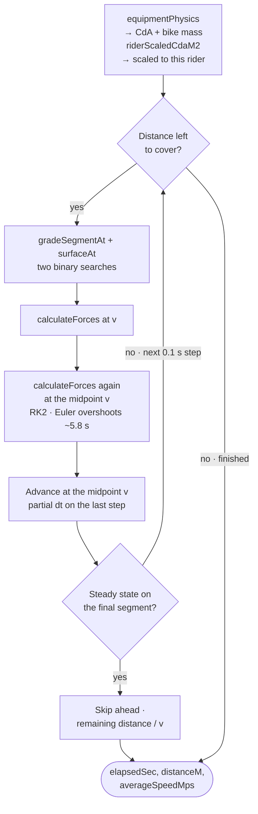
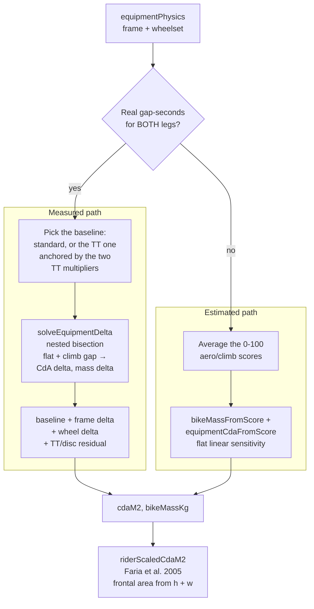
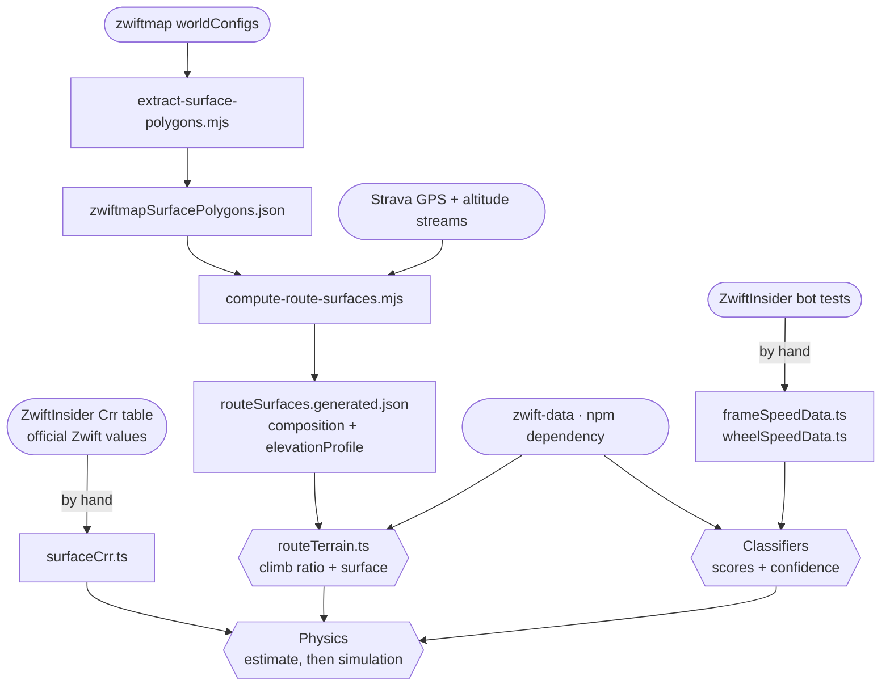
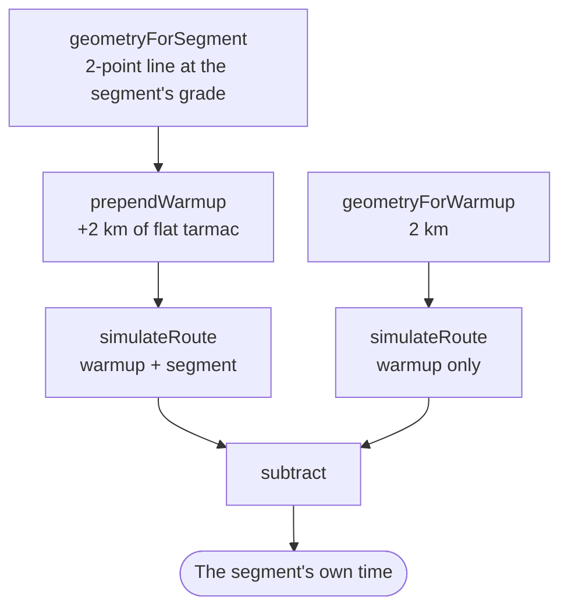

# The physics pipeline, module by module

This is the technical companion to [physics-model.md](physics-model.md). That
document explains *what* the model does and why its numbers can be trusted;
this one explains *how a request actually flows through the code* — which
module runs, in what order, and what each one is allowed to decide.

Read this before changing anything in `shared/utils/physics/`, `finishTime.ts`,
`scoring.ts`, or either recommend endpoint. Most of the historical bugs in this
app were not physics errors — they were ordering errors: a step that ran before
the step whose output it depended on.

## 1. Request lifecycle

The ranking pipeline lives behind two endpoints: one for whole routes,
`server/api/recommend/[slug].get.ts`, shown below; and one for individual
climb/sprint segments, which runs the same pipeline with a different geometry
builder (section 6).

Stage 4 only runs when the rider profile is complete and the `physics` mode is
`dynamic` (the default); without a profile the pipeline stops after stage 3 and
the 0-100 score is the only signal there is.

Stage 1's filters are all "may this combo be shown", never "is it any good" —
which is why `excludeTT` lives there rather than being expressed through
`category`. Zwift disables TT frames outright for ZRL points and scratch races,
so an event page for one of those has to rank only what a rider can legally
start on; `category` can't say that, because it selects exactly one category
and such a race still allows road *and* gravel frames. Being a stage 1 filter
also means it shrinks the pool before `rankCombos` sees it, which is safe in a
way that trimming later would not be — an excluded frame is ineligible, not
merely uninteresting.

Three ordering rules are load-bearing in that diagram, and each one exists
because breaking it shipped a real bug:

- **`rankCombos` scores the entire pool, never a slice.** It truncates only its
  return value, so there is no reason to pre-filter it. Anything that reduces
  the pool before it — including pagination — deletes candidates from existence.
- **`capWheelsetsPerFrame` runs last, and never while searching.** It is
  cosmetic decluttering. Running it earlier once hid 78 of 79 road wheels,
  because on a cobbled route they all tie exactly and only the first survived.
- **The simulated re-order happens before pagination, not after.** The page
  displays simulated times but the pool arrives ordered by the cheap estimate,
  and the two models disagree by more than a constant offset. Without stage 4, a
  combo the simulator ranks 2nd could sit on page two and turn up under "Show
  more matches" faster than everything listed above it.

## 2. Module map

| Module | Owns | Called by |
|---|---|---|
| [catalog.ts](../shared/utils/catalog.ts) | Route/frame lookup over `zwift-data`, cached | Both recommend endpoints |
| [routeTerrain.ts](../shared/utils/routeTerrain.ts) | Climb ratio, terrain weights, surface composition + its confidence level | `catalog.ts` |
| [classifyBikeFrame.ts](../shared/utils/classifyBikeFrame.ts) | Category/style, 0-100 scores, `confidence`, solved CdA/mass delta, garage-level interpolation | `catalog.ts` |
| [classifyWheel.ts](../shared/utils/classifyWheel.ts) | Wheel scores, `crrClass` (road/gravel/mountain), `confidence` | `wheelsets.ts` |
| [wheelsets.ts](../shared/utils/wheelsets.ts) | Pairs front+rear into the wheelsets riders actually equip | Both recommend endpoints |
| [scoring.ts](../shared/utils/scoring.ts) | The 0-100 heuristic score, frame/wheel compatibility, search, display capping | Both recommend endpoints |
| [finishTime.ts](../shared/utils/finishTime.ts) | The cheap closed-form estimate + the isolated surface penalty | Both recommend endpoints |
| [physics/forces.ts](../shared/utils/physics/forces.ts) | `calculateForces`, `powerForSpeed`, `speedForPower`, the physical constants | Simulator, equipment solver, `finishTime.ts` |
| [physics/equipment.ts](../shared/utils/physics/equipment.ts) | CdA and bike mass for a combo; rider frontal area; the gap-seconds inversion | Simulator, `finishTime.ts`, classifiers |
| [physics/routeGeometry.ts](../shared/utils/physics/routeGeometry.ts) | Turning a route + lap count into simulator geometry | Both recommend endpoints |
| [physics/simulator.ts](../shared/utils/physics/simulator.ts) | The integration loop | Everything that needs a real time |
| [physics/simulatedOrdering.ts](../shared/utils/physics/simulatedOrdering.ts) | Which combos are worth really simulating, and dedup by physics key | Both recommend endpoints |
| [physics/routeSurfaceSpeedProfile.ts](../shared/utils/physics/routeSurfaceSpeedProfile.ts) | Speed-vs-distance chart data, from one instrumented simulation run | Route page chart |
| [physics/validate.ts](../shared/utils/physics/validate.ts) | Sanity checks against known-good cases | Dev/verification only |

## 3. Inside `simulateRoute`

One call is one bike finishing one geometry. Everything below repeats every
0.1 s of simulated time (`DEFAULT_DT_SEC`), which is a benchmarked choice, not
a round number — see the constant's comment.

Each `calculateForces` call resolves the same tug-of-war the conceptual doc
describes — the driving force from the rider's power, minus gravity, rolling
resistance and aerodynamic drag — and returns the resulting acceleration.

Grade and surface are looked up **independently** — real surface transitions
do not line up with grade changes, so they are two separate binary searches
over two separate arrays.

Not shown, because it is optional instrumentation rather than part of the
physics: when `boundariesM` is passed, each step also records the elapsed time
at any requested distance it crossed, interpolated within the step. That is how
the route page's speed-vs-distance chart gets its data from a single run.

## 4. Where CdA and bike mass come from

`equipmentPhysics` is the single junction where equipment stops being a rating
and becomes physics. Both the estimate and the simulator call it, which is what
guarantees they never disagree about what a combo *is* — only about how the
route is traversed.

The solve runs at ZwiftInsider's own bot-test protocol — a 75 kg / 183 cm rider
at a steady 300 W, on the two courses they test every frame and wheel on
(Tempus Fugit for the flat gap, Alpe du Zwift for the climb gap).

The measured path requires *both* legs of the combo — mixing an absolute solved
delta on one side with a score-derived value on the other is a unit mismatch.
Frames with fixed wheels are the exception: their measured data already covers
the whole frame+wheel unit, so they never take a wheel-side delta at all.

## 5. Where the data comes from, and when

Only the right-hand column runs per request. Everything on the left is
generated or curated ahead of time and committed.

Rounded nodes are external sources, rectangles are code and committed data
files, and the three hexagons are the only things that run per request.

`compute-route-surfaces.mjs` is paced under Strava's rate limit and takes
roughly 45–50 minutes over ~300 routes; it is resumable, and re-running it is
the only way a newly added route gets its real elevation profile and
metre-by-metre surface data. Until then that route falls back to synthetic
geometry, and `routeTerrain.ts` marks it `unverified` rather than asserting it
is fully paved.

## 6. The segment endpoint's one difference

`server/api/recommend/segments/[slug].get.ts` runs the identical pipeline,
but a segment is entered at speed rather than from a standing start. So it
simulates twice per combo and subtracts:

Both runs share identical starting conditions and identical warmup geometry, so
their elapsed time at the boundary is identical and the subtraction is exact —
no simulator changes were needed to support it.

## 7. Two models, one force calculation

| | `estimateFinishTimeSec` | `simulateRoute` |
|---|---|---|
| Method | Bisection for steady-state speed, one average grade | Time-stepped RK2 integration, 0.1 s |
| Terrain | Route's average climb ratio, applied uniformly | Real gradient and surface at each position |
| Acceleration | None — assumes one constant speed | Modelled explicitly, every step |
| Cost | Cheap enough to run on everything | Scales with route duration — see section 8 |
| Runs on | The full ~11k pool | The reachable window only, deduped by physics key |
| Shown to riders | Never in `dynamic` mode | Always |

Both call the same `calculateForces`. The disagreement between them is not a
constant offset: applying one average grade charges a rider for climbing every
metre of a rolling loop and never hands the descent back, so the estimate
systematically overweights bike mass. That is exactly why it is allowed to
narrow the field but never to produce a displayed number.

The `physics` query parameter exposes both for debugging: `legacy` shows the
estimate's times, `compare` returns both and keeps the estimate's ordering so
the divergence is visible, and `dynamic` (the default) is the real thing.

## 8. Cost, and where it goes

Almost all request time is stage 4. The window is `offset + limit + 45` combos,
deduplicated by `CdA|mass|crrClass` — cosmetic re-skins and colourways collapse
to one run. The margin of 45 is flat by design and dominates cost on long
routes (~2.5 s for a page of Zwift Gran Fondo at 97.5 km, versus ~50 ms on a
2 km circuit).

If that tail ever needs fixing, the lever is to key the margin on how tightly
packed the field is, **not** on route length — those are different things.
Gran Fondo's combos are 10–210 s apart and stayed inversion-free at a margin of
18; Canopies and Coastlines' combos are fractions of a second apart, and that
same 18 put a 1.6 s inversion back on page one.
