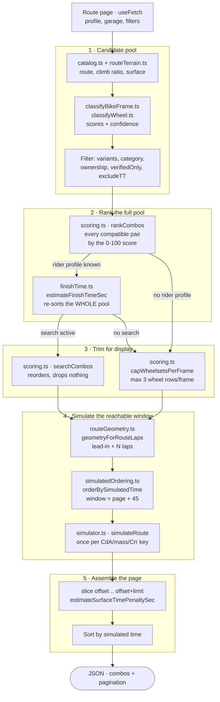
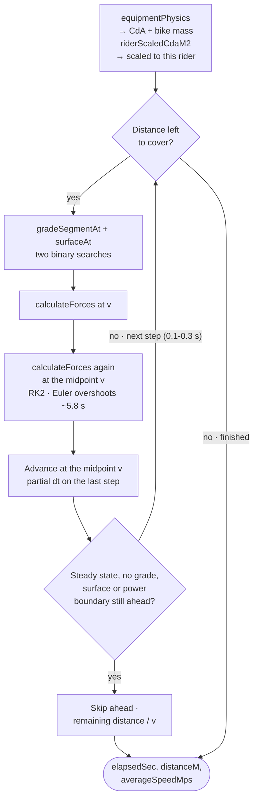
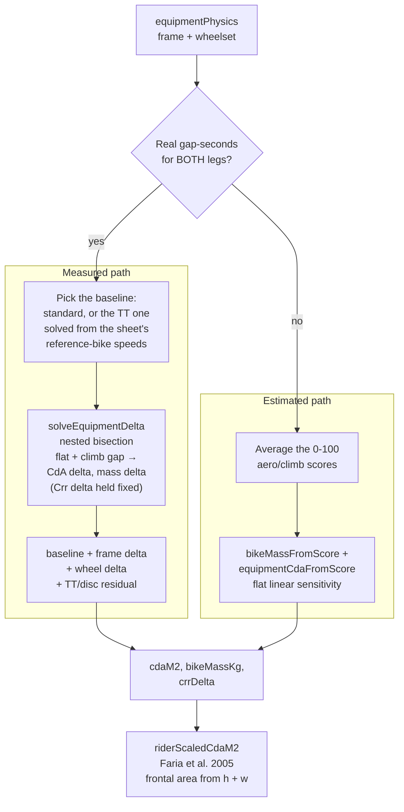
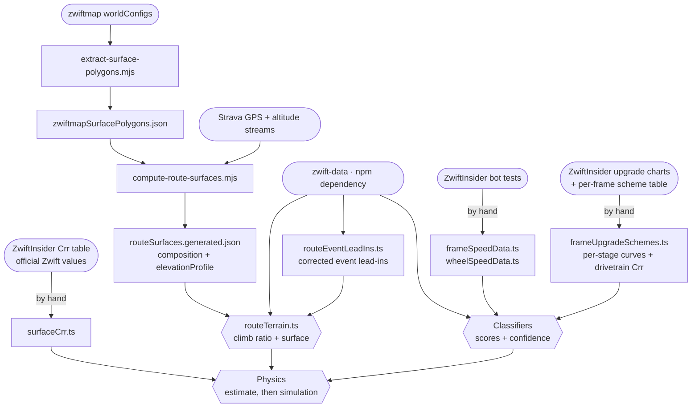
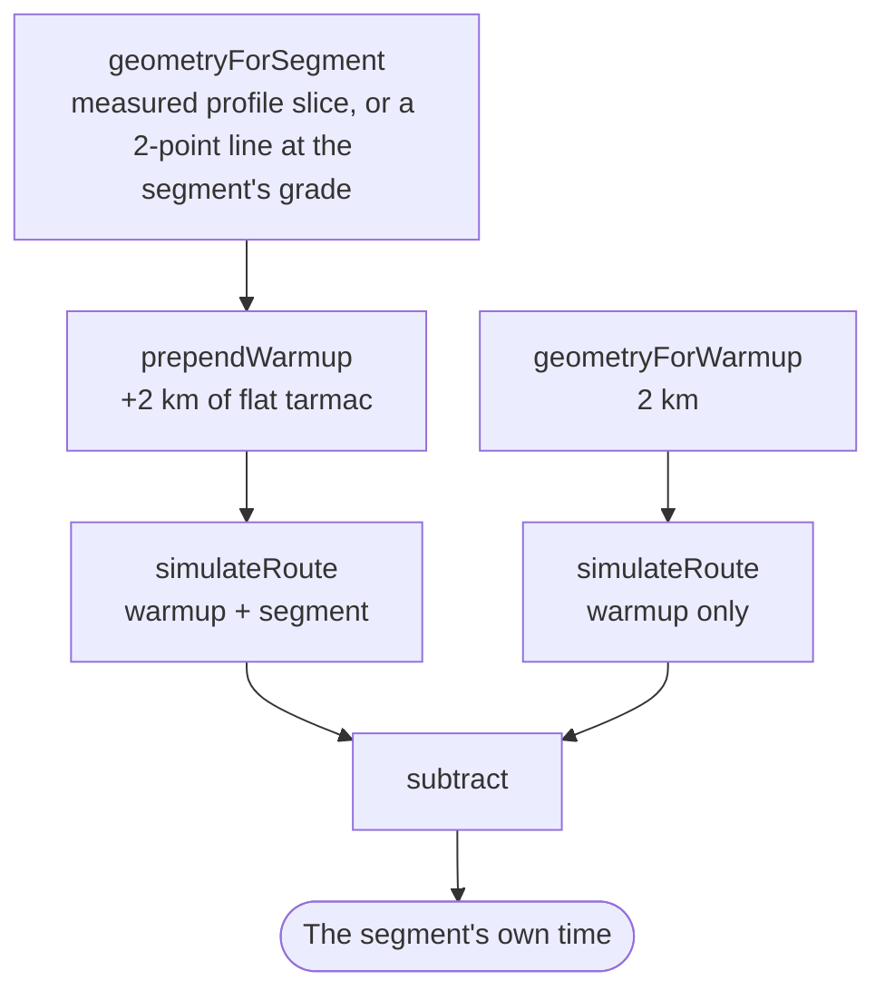

# The physics pipeline, module by module

This is the technical companion to [physics-model.md](physics-model.md). That
document explains *what* the model does and why its numbers can be trusted;
this one explains *how a request actually flows through the code* — which
module runs, in what order, and what each one is allowed to decide.

Read this before changing anything in `shared/utils/physics/`, `finishTime.ts`,
`scoring.ts`, or either recommend endpoint. Most of the historical bugs in this
app were not physics errors — they were ordering errors: a step that ran before
the step whose output it depended on.

## 1. Request lifecycle

The ranking pipeline itself is one module, `server/utils/recommendPipeline.ts`,
shown below. Two thin endpoints hand it a ride: `server/api/recommend/[slug].get.ts`
for whole routes, and `server/api/recommend/segments/[slug].get.ts` for
individual climb/sprint segments, which differs only in how its geometry is
built and how one combo is timed on it (section 6).

Stage 4 only runs when the rider profile is complete and the `physics` mode is
`dynamic` (the default); without a profile the pipeline stops after stage 3 and
the 0-100 score is the only signal there is.

Stage 1's filters are all "may this combo be shown", never "is it any good" —
which is why `excludeTT` lives there rather than being expressed through
`category`. Zwift disables TT frames outright for ZRL points and scratch races,
so an event page for one of those has to rank only what a rider can legally
start on; `category` can't say that, because it selects exactly one category
and such a race still allows road *and* gravel frames. Being a stage 1 filter
also means it shrinks the pool before `rankCombos` sees it, which is safe in a
way that trimming later would not be — an excluded frame is ineligible, not
merely uninteresting.

Three ordering rules are load-bearing in that diagram, and each one exists
because breaking it shipped a real bug:

- **`rankCombos` scores the entire pool, never a slice.** It truncates only its
  return value, so there is no reason to pre-filter it. Anything that reduces
  the pool before it — including pagination — deletes candidates from existence.
- **`capWheelsetsPerFrame` runs last, and never while searching.** It is
  cosmetic decluttering. Running it earlier once hid 78 of 79 road wheels,
  because on a cobbled route they all tie exactly and only the first survived.
- **The simulated re-order happens before pagination, not after.** The page
  displays simulated times but the pool arrives ordered by the cheap estimate,
  and the two models disagree by more than a constant offset. Without stage 4, a
  combo the simulator ranks 2nd could sit on page two and turn up under "Show
  more matches" faster than everything listed above it.

## 2. Module map

| Module | Owns | Called by |
|---|---|---|
| [catalog.ts](../shared/utils/catalog.ts) | Route/frame lookup over `zwift-data`, cached; applies `routeEventLeadIns.ts` so every consumer sees one ridden distance | `recommendPipeline.ts`, both recommend endpoints |
| [routeEventLeadIns.ts](../shared/data/routeEventLeadIns.ts) | Event lead-in corrections for the few routes where Zwift's own published figure is wrong (see race-drafting.md §5) | `catalog.ts` |
| [routeTerrain.ts](../shared/utils/routeTerrain.ts) | Climb ratio, terrain weights, surface composition + its confidence level | `catalog.ts` |
| [classifyBikeFrame.ts](../shared/utils/classifyBikeFrame.ts) | Category/style, 0-100 scores, `confidence`, solved CdA/mass/Crr delta, per-scheme garage-level staging | `catalog.ts` |
| [classifyWheel.ts](../shared/utils/classifyWheel.ts) | Wheel scores, `crrClass` (road/gravel/mountain), `confidence` | `wheelsets.ts` |
| [wheelsets.ts](../shared/utils/wheelsets.ts) | Pairs front+rear into the wheelsets riders actually equip | `recommendPipeline.ts` |
| [scoring.ts](../shared/utils/scoring.ts) | The 0-100 heuristic score, frame/wheel compatibility, search, display capping | `recommendPipeline.ts` |
| [finishTime.ts](../shared/utils/finishTime.ts) | The cheap closed-form estimate + the isolated surface penalty | `recommendPipeline.ts` |
| [physics/forces.ts](../shared/utils/physics/forces.ts) | `calculateForces`, `powerForSpeed`, `speedForPower`, the physical constants | Simulator, equipment solver, `finishTime.ts` |
| [physics/equipment.ts](../shared/utils/physics/equipment.ts) | CdA and bike mass for a combo; rider frontal area; the gap-seconds inversion | Simulator, `finishTime.ts`, classifiers |
| [physics/routeGeometry.ts](../shared/utils/physics/routeGeometry.ts) | Turning a route + lap count into simulator geometry | Both recommend endpoints |
| [physics/simulator.ts](../shared/utils/physics/simulator.ts) | The integration loop | Everything that needs a real time |
| [physics/simulatedOrdering.ts](../shared/utils/physics/simulatedOrdering.ts) | Which combos are worth really simulating, and dedup by physics key | `recommendPipeline.ts` |
| [physics/routeSurfaceSpeedProfile.ts](../shared/utils/physics/routeSurfaceSpeedProfile.ts) | Speed-vs-distance chart data, from one instrumented simulation run | Route page chart |
| [physics/validate.ts](../shared/utils/physics/validate.ts) | Sanity checks against known-good cases | Dev/verification only |

## 3. Inside `simulateRoute`

One call is one bike finishing one geometry. Everything below repeats every
step of simulated time: 0.1 s (`DEFAULT_DT_SEC`) up to 60 km, growing
linearly with distance beyond that to a 0.3 s cap (`MAX_DT_SEC`) so the step
count stays roughly constant on long routes. Both are benchmarked choices, not
round numbers — see the constants' comments.

Each `calculateForces` call resolves the same tug-of-war the conceptual doc
describes — the driving force from the rider's power, minus gravity, rolling
resistance and aerodynamic drag — and returns the resulting acceleration.

Grade and surface are looked up **independently** — real surface transitions
do not line up with grade changes, so they are two separate binary searches
over two separate arrays.

**The alignment convention** (normative — every code comment about measured
positions defers here): all measured per-route data is **lap-relative and in
official kilometres**. `route.surface.segments` and
`route.terrain.elevationProfile` cover exactly one lap, starting at the lap's
own start and ending exactly on the official lap distance; climb/sprint
placements with `perLap: true` are lap-relative too. The lead-in is separate data: the few
routes whose GPS trace covered it carry `leadInSegments` /
`leadInElevationProfile` (relative to the ride start), and ride-relative
placement positions exist only on the routes `placementsAreRideRelative`
detects. Lap-relativity is enforced at generation time by
`scripts/route-surfaces/normalize.mjs` (issue #126 — before normalization,
consumers guessed the alignment and guessed differently, shifting elevation
shapes, surfaces and segment slices by up to the lead-in length). The official
kilometres are enforced at load time by `shared/utils/traceScale.ts`, which
stretches both arrays onto the official distance with one shared factor as
`estimateSurface`/`computeTerrain` read them (issue #171 — before that, only
the elevation profile was rescaled and the surface segments were clipped, so
on the 24 routes whose community Strava trace disagrees with the official
distance by more than 1% the two described different roads, and on the 163
routes with a short trace the ride ended on a stretch carrying no surface
segment at all).

**Placements are the exception**, and the one thing that still speaks in trace
kilometres: zwift-data's `segmentsOnRoute` positions are measured along the
route's real geometry rather than against its published distance, and on 36 of
the 37 routes where the two can be told apart the last placement lands on the
community trace's length, not the official one. `SurfaceEstimate.traceScale`
carries the factor so `routeSegments.ts` can put a placement into the measured
arrays' coordinates before slicing them; that is the only place a placement
meets measured data, and a segment's own sliced arrays are then rescaled onto
the segment's own length, so they obey the same rule a route's do.

A route without `leadInSegments` rides its lead-in on tarmac (every start pen
is paved) rather than the lap's own surface mix, unless the lap is a single
surface end to end (Paris: all cobbles, pens included) - see
`unmeasuredLeadInSurface`, which `estimateFinishTimeSec`'s `leadInCrr` also
calls so the ranking key and the simulator agree.

**Routes with a mix but no positions**: a handful of routes have no Strava
segment at all and carry hand-curated percentages instead. They are ridden as
one block per surface, sized to its share and laid out biggest first
(`surfaceSegmentsFromComposition`, issue #172). The amount of each surface is
right and its position is not, which is the honest reading of what a curated
percentage knows. Before this they were ridden as 100% of their most prevalent
surface, so Peaky Pave's 30% of cobbles existed for `estimateFinishTimeSec`
and not for the simulator.

The steady-state skip only fires once every boundary that could change the
equilibrium is behind the step's **start** position: the final grade segment
must reach the finish, and the last interior surface join and the last power
override must both be passed (issue #124 — before the surface guard, a
2-point segment geometry extrapolated one surface's speed across every join
after steady state, costing the Alpe segment's 1.5 km of dirt nothing). The
final surface segment's own end is deliberately not a boundary: it is the
finish line, not a join, so nothing after it can change the equilibrium. (It
used to fall short of the finish, and treating that trailing gap as a join
would have disabled the skip on essentially every route; since #171 the
segments end exactly on the route distance and the gap is gone.)

Not shown, because it is optional instrumentation rather than part of the
physics: when `boundariesM` is passed, each step also records the elapsed time
at any requested distance it crossed, interpolated within the step. That is how
the route page's speed-vs-distance chart gets its data from a single run.

## 4. Where CdA and bike mass come from

`equipmentPhysics` is the single junction where equipment stops being a rating
and becomes physics. Both the estimate and the simulator call it, which is what
guarantees they never disagree about what a combo *is* — only about how the
route is traversed.

The solve runs at ZwiftInsider's own bot-test protocol — a 75 kg / 183 cm rider
at a steady 300 W, on the two courses they test every frame and wheel on
(Tempus Fugit for the flat gap, Alpe du Zwift for the climb gap).

### Validated at a second power

Two unknowns fitted to two equations always close, so the 300 W round trip in
`equipment.test.ts` proves only that the solver is self-consistent, not that it
put the right share of a frame's advantage into CdA rather than mass. The sheet
also tests every bike at 150 W, and every wheel on the Zwift TT frame, and
those rows are held out of the solve entirely: they live beside the 300 W
fields as `at150W` (frames and wheels) and `onTtFrame` (wheels), imported by
`scripts/zwiftinsider/import-validation-gaps.mjs`, and nothing at runtime reads
them. The golden tests forward-simulate the 300 W-solved deltas at 150 W and on
the TT baseline and compare.

At import (2026-09-03) the 212 frame rows sat at a median residual of 0.5 s/h
flat and 0.9 s/h climb, the wheels at 0.7 / 1.1, and the 64 wheel-on-TT rows at
0.3 / 1.1 — so the CdA/mass split holds, and applying a wheel's road-solved delta
on the TT baseline (plus the disc residual) holds for the whole roster, not just
the reference disc it was calibrated on. What sits outside the bar is pinned in
the test with its reason: the three road-table frames the bot rode on gravel or
MTB wheels (Allied Able, Canyon Inflite, Canyon Lux — their tarmac penalty is
rolling resistance, which a CdA-and-mass solve can only launder into the wrong
levers, and it shows at 150 W as +95 to +125 s/h), the Cadex Max 50's 300 W road
row (which disagrees with both its other rows), and three Zwift novelty wheels
that the disc regex credits the TT-frame disc bonus but the sheet shows get none.

The measured path requires *both* legs of the combo — mixing an absolute solved
delta on one side with a score-derived value on the other is a unit mismatch.
Frames with fixed wheels are the exception: their measured data already covers
the whole frame+wheel unit, so they never take a wheel-side delta at all.

### Upgrade stages feed the solve

Only Stage 0 and Stage 5 are bot-tested per frame, so an in-between garage
level comes from `frameUpgradeSchemes.ts`, which stores ZwiftInsider's
published per-stage curve for each of the 9 upgrade schemes (Distance /
Duration / Elevation × Entry / Mid / High, with Halo sharing High). The curve
only decides *where between the two measured endpoints* a level sits, so Stage
0 and Stage 5 still reproduce the measured numbers exactly.

This matters because the real curves are steep and uneven, not linear. An
entry-level frame has all its performance by Stage 3 (Stages 4 and 5 are Drops
and XP bonuses). A Duration/High-End TT frame gets over half its flat aero
benefit at Stage 5 alone, and nothing at all on the flat at Stage 4.

Stage 3 is a "Drivetrain" upgrade in every scheme, and it is *not* a drivetrain
efficiency change despite the name — an efficiency multiplier would save the
same wattage at any speed, whereas the charts show it saving ~2.6 W on the flat
and ~1.0 W on the climb. That 2.6:1 ratio tracks the flat/climb speed ratio,
which is the signature of a rolling-resistance change, so it is modelled as a
fixed `crrDelta` of −0.0003 rather than being folded into CdA or mass. It is
held fixed during the solve, not solved for: there are only two measurements,
so a third free unknown would be underdetermined. (The 150 W rows would make a
third lever determinable, but they are deliberately kept as the check rather
than fed into the fit.)

Keeping it separate changes nothing on the two bot-test courses — the solve
still reproduces both endpoints — but it stops a grade-independent effect from
being laundered into two grade-dependent ones, which is what made it transfer
incorrectly to routes with different gradients and surfaces.

For the per-scheme curves themselves, worked examples, and the diagnostic
scripts that verify this data, see
[bike-upgrade-levels.md](bike-upgrade-levels.md) and
[scripts/upgrade-levels/](../scripts/upgrade-levels/).

## 5. Where the data comes from, and when

Only the right-hand column runs per request. Everything on the left is
generated or curated ahead of time and committed.

Rounded nodes are external sources, rectangles are code and committed data
files, and the three hexagons are the only things that run per request.

`compute-route-surfaces.mjs` is paced under Strava's rate limit and takes
roughly 45–50 minutes over ~300 routes; it is resumable, and re-running it is
the only way a newly added route gets its real elevation profile and
metre-by-metre surface data. Until then that route falls back to synthetic
geometry, and `routeTerrain.ts` marks it `unverified` rather than asserting it
is fully paved.

## 6. The segment endpoint's one difference

`server/api/recommend/segments/[slug].get.ts` runs the identical pipeline -
literally the same module - but a segment is entered at speed rather than from
a standing start. So its ride simulates twice per combo and subtracts:

Both runs share identical starting conditions and identical warmup geometry, so
their elapsed time at the boundary is identical and the subtraction is exact —
no simulator changes were needed to support it.

## 7. Two models, one force calculation

| | `estimateFinishTimeSec` | `simulateRoute` |
|---|---|---|
| Method | Bisection for steady-state speed, one average grade | Time-stepped RK2 integration, 0.1 s (up to 0.3 s past 60 km) |
| Terrain | Route's average climb ratio, applied uniformly | Real gradient and surface at each position |
| Acceleration | None — assumes one constant speed | Modelled explicitly, every step |
| Cost | Cheap enough to run on everything | Scales with route duration — see section 8 |
| Runs on | The full ~11k pool | The reachable window only, deduped by physics key |
| Shown to riders | Never in `dynamic` mode | Always |

Both call the same `calculateForces`. The disagreement between them is not a
constant offset: applying one average grade charges a rider for climbing every
metre of a rolling loop and never hands the descent back, so the estimate
systematically overweights bike mass. That is exactly why it is allowed to
narrow the field but never to produce a displayed number.

The `physics` query parameter exposes both for debugging: `legacy` shows the
estimate's times, `compare` returns both and keeps the estimate's ordering so
the divergence is visible, and `dynamic` (the default) is the real thing.

## 8. Cost, and where it goes

Almost all request time is stage 4. The window is `offset + limit + 45` combos,
deduplicated by `CdA|mass|crrDelta|crrClass` — cosmetic re-skins and colourways collapse
to one run. The margin of 45 is flat by design and dominates cost on long
routes (~2.5 s for a page of Zwift Gran Fondo at 97.5 km, versus ~50 ms on a
2 km circuit).

If that tail ever needs fixing, the lever is to key the margin on how tightly
packed the field is, **not** on route length — those are different things.
Gran Fondo's combos are 10–210 s apart and stayed inversion-free at a margin of
18; Canopies and Coastlines' combos are fractions of a second apart, and that
same 18 put a 1.6 s inversion back on page one.

## 9. TTT draft mode

`draftMode=ttt` (with `tttRiders` 2–8 and optional `tttClimbWkg`) threads a
Team Time Trial through the whole pipeline without touching any equipment
physics. The rider's entered power still means **their own average over a full
rotation** — the same thing it means in solo mode — and the paceline rides at
the speed that combined effort produces. No CdA changes anywhere, and the
solvers in `equipment.ts` (which invert ZwiftInsider's no-draft bot protocol)
stay draft-free by construction.

An earlier iteration treated the entered watts as the *front rider's* power.
That is defensible physics — Zwift gives the front no draft — but useless as a
tool, because it makes TTT and solo produce identical times by definition. Real
TTT calculators (ZwiftInsider's own, Target Watts) take each rider's
sustainable effort and *derive* the pull watts, which is what this now does.

Everything lives in `shared/utils/physics/draft.ts`, and the full reasoning
and validation evidence is in [ttt-drafting.md](ttt-drafting.md):

- **Per-position power savings** come from ZwiftInsider's **Pack Dynamics 4.1**
  single-file TTT test on TT bikes: 22% / 28.7% / 34% behind the front for
  wheels 2–4, with positions 5–8 assumed to plateau at 34%. Their published
  equal-pulls figure (300 W front → "each rider would average 237 W")
  reproduces exactly from those numbers, which is the cross-check that they
  were read correctly.
- **Team size still matters past the 4th wheel**, despite the plateau: a
  4-rider team spends 1/4 of its time on the front, an 8-rider team 1/8, so
  the rotation average drops from 0.788 to 0.724 of the front rider's power —
  about 9% of sustained effort.
- **`tttPowerScaleAtSpeed`** is the multiplier that makes this real:
  `1 / averagePowerFactor(speed)`. The simulator applies it at both midpoint
  velocities each step (`SimulateRouteOptions.powerScaleAtSpeed`), so the
  benefit fades as the group slows on a climb and grows on a descent with no
  per-grade bookkeeping. It is a feedback loop but a stable one — the scale
  saturates while drag keeps growing with v³.
- **Savings scale with speed** (`draftSavingsSpeedScale`): a clamped power-law
  fit to ZwiftInsider's measured 25% (flat), ~10% (moderate climb), 2–3%
  (steep climb) and up-to-46% (descent) single-rider numbers.
- **`tttPowerPlan`** detects long climbs and paces them at `tttClimbWkg ×
  weight` via `powerSegmentsW`. A stretch qualifies on **speed, not grade**:
  the question is "when does the team stop rotating", and the same grade is a
  different event for different riders (at 3%, a 2.5 W/kg rider has already
  lost the rotation while a 4.0 W/kg rider still holds 42% of the flat draft),
  so a grade threshold split them wrongly. A block now counts once the
  estimated solo speed at normal power drops to where the draft is worth a
  quarter of its flat value (`draftSavingsSpeedScale` = 0.25, ~21.1 km/h -
  `CLIMB_BLOCK_MAX_SPEED_MPS`) for at least 2.5 estimated minutes
  (`CLIMB_BLOCK_MIN_DURATION_SEC`, down from 210 s, which missed climbs teams
  visibly ride individually), with short sub-threshold gaps merged. The plan is computed **once per request** and shared by
  every combo — a per-combo plan would poison `orderBySimulatedTime`'s
  physics-keyed dedupe cache. The cheap estimate mirrors the same physics:
  `tttGroupSpeedMps` is a 4-iteration fixed point (draft depends on speed,
  speed depends on draft), plus the same two-phase climb split, so ranking
  keeps tracking the simulator. With `draftMode=solo` neither model changes
  at all.
- **The "saves X vs solo" comparison** simulates one extra ride (top combo,
  first page only): the same rider, same power, same pacing plan, with the
  draft scaling removed. The only difference between the two rides is the
  draft, so the gap is exactly what the paceline is worth.

## 10. Race draft mode

`draftMode=race` models a mass-start bunch, and it did extend the module above
rather than duplicate it: same `draftSavingsSpeedScale`, same
scale-as-power-multiplier plumbing at both midpoint velocities each step, same
`equipment.ts`-stays-draft-free rule. Only the rotation model is replaced — by a
single number.

- **One constant, no inputs.** `RACE_DRAFT_SAVING = 31%` is the flat-speed power
  saving of a typical mid-pack racer, field-calibrated against real ZwiftPower
  race fields — seven constant-setting races out of twenty collected (1654
  riders; pooled bunch median 31.4%, n = 473 bunch finishers). There is no rider count, no position, no category and no
  grade term, because a racer does not occupy a position in a mass start — they
  occupy a distribution of positions, and the constant is the time-weighted
  expectation over it. Full evidence in
  [race-drafting.md](race-drafting.md).
- **`racePowerScaleAtSpeed`** is the whole transform:
  `1 / (1 − saving × draftSavingsSpeedScale(v))`. Its exactness is load-bearing —
  the constant was bisected per rider under precisely this expression against
  `simulateRoute`, so changing the curve or the application point invalidates the
  31% rather than improving it. `saving` is a defaulted parameter, which is where
  a future per-category or effort-preset value plugs in.
- **No power plan.** `tttPowerPlan` stays TTT-only: the speed curve already makes
  the benefit fade on a climb, and "the bunch settles into its own climbing pace"
  is a model the data does not support.
- **The cheap estimate** solves `raceGroupSpeedMps`, the same 4-iteration fixed
  point as TTT's, so full-pool ranking keeps tracking the displayed simulated
  times. `estimateFinishTimeSec`'s draft argument is a discriminated union
  (`{ mode: 'ttt', … } | { mode: 'race' }`) so a fourth mode is a new arm rather
  than a new parameter at every call site. With `draftMode=solo` both models are
  bit-identical to before race mode existed.
- **What it is worth**, reference rider (75 kg, 3.0 W/kg): ~11% faster than solo
  on the flat, ~10% rolling, ~3% on Alpe du Zwift — monotone in climbing with no
  grade term, and much smaller than the 31% power saving because speed goes as
  roughly the cube root of power. Reproduce with
  `node scripts/race-draft/validate-race-draft.mjs`.
