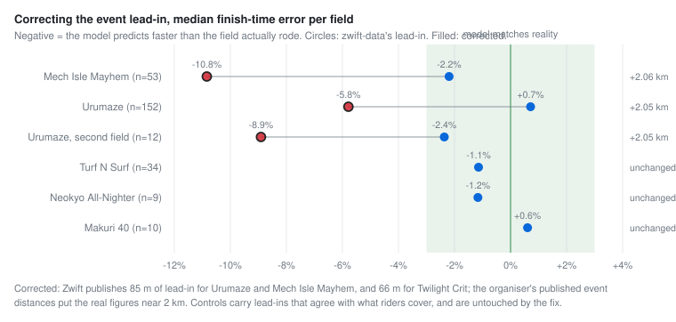
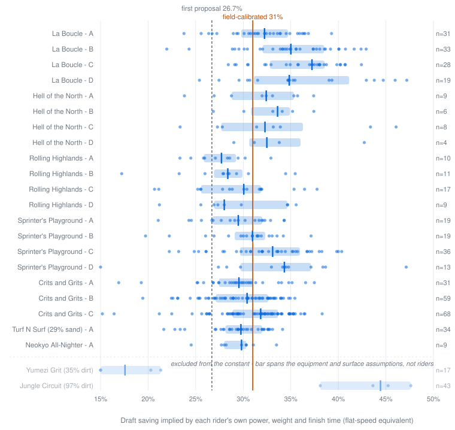
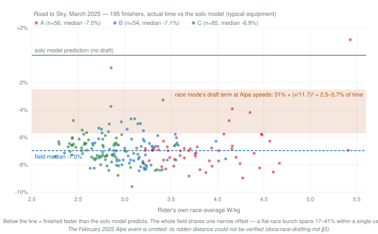
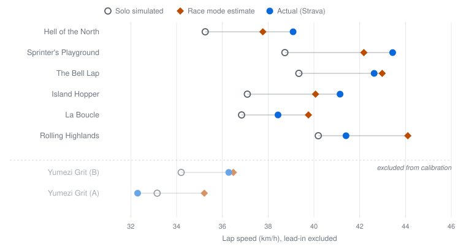

# Race drafting: what a mass-start mode needs, and what real races say about it

Reference for race draft mode, which **is now implemented** - `draftMode=race` on
the recommend endpoints, "Race (pack draft)" in the rider profile. It
extends [`shared/utils/physics/draft.ts`](../shared/utils/physics/draft.ts)
rather than duplicating it, as `ttt-drafting.md` §6 asked; this document is the
evidence behind the one constant it ships, and the validation work behind that.

What shipped is deliberately narrower than what this document explores. Sections
1-8 propose several terms - a position distribution, cohesion, surge loss, a
surface interaction - and then measure each one to zero or into the constant.
**Race mode ships as `RACE_DRAFT_SAVING = 31%` scaled by the existing
`draftSavingsSpeedScale` curve, and nothing else.** §10 records what that does to
the predicted times, and §11 how to recalibrate it. Read a term's section for
why it is not in the code; read §10 for what is.

The rider-facing sentences below are written in the conditional ("would") where
they predate the implementation. That tense is left alone on purpose: it marks
which paragraphs are the original argument for the design and which were written
after it existed.

## 1. What the rider would be asked for

**Nothing new.** Your W/kg still means your own sustainable effort, exactly as in
solo and TTT mode. Race mode adds no required inputs.

This is deliberate. An earlier draft of this document proposed `fieldSize` and
`racePosition` parameters, mirroring the TTT rider model. That is the wrong
shape for a mass start. A racer does not occupy a position — they occupy a
*distribution* of positions, continuously: drifting back through the bunch,
getting shuffled to the side and out of shelter entirely, burning a match to
close a gap, recovering deep in the field. Asking someone to name their wheel
number is asking for a number that does not exist.

What the model needs instead is the time-weighted expectation over all of those
states, which is a property of racing rather than of the rider.

**One thing does need saying in the UI.** The number entered is the rider's
*mechanical average power for the whole race* — the same thing solo and TTT
mode mean, but easier to get wrong here, because racers know their numbers as
20-minute or normalised power. Across the 1543 field results in §5 the median
variability index was 1.05, so entering normalised power instead feeds the model
~5% too much power, which on a flat circuit is ~2% too much speed — and doing
the same thing inside the *calibration* is what made the first version of this
document 6 points low (§6).

## 2. Why race draft is not TTT draft with a different constant

TTT mode derives everything from one number because the rotation is known: each
rider spends 1/N of the time in each position, so `averageFactor(speed)` falls
out cleanly. A mass start has no rotation — but it does have a stationary
distribution, and that is the useful analogue.

Three things happen in a race that never happen in a paceline:

- **Displacement.** Zwift steers for you. You get pushed to the edge of the
  bunch and out of the draft without any decision on your part.
- **Gap closing.** Every split, surge and gradient change costs an
  acceleration. That work produces no sustained speed — it buys back a position
  you already had.
- **Fragmentation.** The field strings out and shatters on climbs and on rough
  surfaces, and what was a bunch becomes several small groups.

None of these are edge cases. They happen in essentially every race, which is
why they belong in the base model rather than behind a flag.

**The rider is never fully dropped.** Being dropped is a real thing that happens
and it is analysed at length in §7 — but as a property of the *validation data*,
not of the simulation. A `dropAt` input was considered and rejected: it models a
race the rider lost rather than the race they rode, and it makes the power
multiplier discontinuous for no modelling gain.

## 3. The data it would be built on

### Per-position power savings

TTT mode uses ZwiftInsider's PD4.1 **TT-bike** test. Race mode should use the
**road-bike** test on **PD4.1.1**, the newer pack model:
<https://zwiftinsider.com/road-bike-drafting-pd411/>

| Position | Saving vs front | TTT doc's TT-bike figure (PD4.1) |
|---|---|---|
| 2 | 25% | 22% |
| 3 | 32.7% | 28.7% |
| 4 | 37.6% | 34% |

Road frames draft slightly better than TT frames, and PD4.1.1 extended the draft
fall-off point relative to PD4.1 — the 4th rider held on with 18 W less. Using
the TT numbers for road racing would understate by 3–4 points at every position.

### The position distribution

Rather than asking which wheel, take the expectation across the states a racer
actually occupies:

| State | Time share | Saving |
|---|---|---|
| On the front, or gapped and closing | 6% | 0% |
| Second wheel | 8% | 25% |
| Third wheel | 10% | 32.7% |
| Deep in the bunch | 66% | **39%** |
| Displaced to the side, no shelter | 10% | 0% |

**Expected saving: 31%.**

Two of those numbers are not ZwiftInsider's, and it matters which:

- **39% for "deep in the bunch" is fitted**, to the 473 real bunch finishers in
  §5. It is the model's one free parameter and the only number here that is not
  either measured or a time budget.
- **The 16% of race time with no shelter at all** is still a judgement call, as
  it was in the first version of this document.

Everything else is ZwiftInsider's published road-bike test.

An earlier version of this section put the deep state at the 4-bot test's 37.6%
and reached an expected saving of 26.7%. Seven real fields say that is too low by
about four points. The arithmetic is tight rather than impossible: holding the
4-bot ceiling, the most a rider can save while still spending 16% of the race in
the wind is 0.84 x 37.6% = 31.6%, and that requires *all* of their sheltered
time to be spent at fourth-wheel-or-deeper — no time at second or third wheel at
all. So the observed 31% is reachable only at the very edge of what the 4-bot
test allows, which is itself the finding: **in a mass start you are deep in the
bunch nearly all of the time you are sheltered at all**, and a big bunch shelters
at least as well as the fourth bot in a 4-bot line. The fitted 39% expresses
that as one number rather than as a knife-edge time budget.

### Speed dependence

**Reuse the existing fit unchanged.** `draft.ts` already scales savings by
`(v / 11.7)²` clamped to `[0, 1.4]`, anchored on
<https://zwiftinsider.com/draft-savings/>. Drafting is aerodynamic regardless of
event format. Duplicating this would be the mistake `ttt-drafting.md` §6 warns
against.

§5 gives this its first real-race test, and returns the one result in this
document that argues with an existing constant. After dividing out
`(v / 11.7)²`, the implied flat-speed saving is **not** independent of how fast
the field rode: across 19 race-and-category groups it falls by 0.47 points per
km/h (r = −0.55), from ~29.5% for the 43 km/h A fields to ~34.5% for the 35 km/h
D fields, and the ordering A > B > C > D holds *inside* every single race.

Two explanations fit equally well and this data cannot separate them:

1. The `v²` scaling is slightly too steep near 40 km/h, so backing a constant
   out at 43 km/h under-counts and at 35 km/h over-counts.
2. Faster fields are *harder-raced* fields. A cat attacks, splits and rotates
   more than D cat on the same course, which is time in the wind, not a
   different aerodynamic law.

**Do not refit the curve on this.** Its shape is anchored by ZwiftInsider
measurements at 18 and 27 km/h — climbing speeds — and these races span only
32–43 km/h. A local slope correction near the flat anchor would have to
extrapolate into a region this data never visits, to fix an effect that may not
be aerodynamic at all. What it does mean is that a single constant is a
compromise across categories: it is ~1 point optimistic for an A field and
~3.5 points pessimistic for a D field.

## 4. Grade, surface, and pack cohesion

Grade and surface make drafting harder through **two independent mechanisms**,
and it matters that they are not conflated:

1. **Aerodynamic.** At climbing speed, aero is a small share of total
   resistance, so there is less drag to hide from. This is *already handled* by
   `(v / 11.7)²` and must not be re-applied.
2. **Behavioural.** The bunch fragments. On a climb the field strings out and
   splits by W/kg; on gravel and cobbles it splits by equipment, because wheel
   Crr class dominates and speed dispersion across the field widens sharply. A
   fragmented field means fewer wheels to sit on, whatever the physics says.

Only the second is new. Proposed as a cohesion multiplier on the expected
saving:

```
cohesion = clamp(1 − kg · max(0, grade − 1%) − ks · surfaceTerm,
                 COHESION_FLOOR, 1)
```

with `kg` and `ks` both shipping at 0 — see below for why neither of this
document's datasets can fit them.

Evaluate the grade term on **instantaneous** grade per timestep, not
route-average — a lap route averages to zero grade by construction, so a
route-average form of it would silently do nothing.

`COHESION_FLOOR` is why the rider is never fully dropped. Even a shattered field
on a 10% gradient leaves someone to ride with. Suggested floor 0.35; it must
never be 0, or race mode degenerates into solo mode on hard routes.

The two mechanisms **multiply**, so a steep gravel climb collapses draft to
near-nothing. That is correct — TTT mode already shows the aero term alone
taking Road to Sky down to a 2.8% benefit.

### The surface term stays at zero, and this is now a measured claim

Two versions of this document have tried to give `ks` a value, and the second
tried hardest. §5 has two loose-surface races, and between them they show that
**this method cannot measure surface fragmentation at all** — not that the
effect is absent, but that the error bar on the measurement is several times
larger than the effect.

The first dirt race looked like clean evidence. Yumezi Grit is 35% dirt, its
implied saving is 14.9% against a 31% baseline, and only 27% of its finishers
came to the line with a group against 55–85% on the tarmac circuits. A cohesion
term fitted on it gives `ks ≈ 1.5` on loose-surface share.

The second dirt race destroys that fit. Jungle Circuit is **97% dirt** — three
times Yumezi's loose share, the roughest route in the set — and it returns the
**highest** implied saving of any race here:

| Race | Loose share | Implied saving (road kit) | Implied saving (gravel kit) |
|---|---|---|---|
| Yumezi Grit | 35% dirt | 14.9% | 21.3% |
| Jungle Circuit | 97% dirt | 45.2% | 38.1% |

A term that predicts less draft as the surface gets looser cannot survive its
two data points landing on opposite sides of the baseline, in the wrong order.

**Why both numbers are untrustworthy.** On a dirt route the implied saving stops
being a measurement of draft and becomes a measurement of the rolling-resistance
table:

| Lever | Five tarmac races | Yumezi Grit | Jungle Circuit |
|---|---|---|---|
| Real surfaces → all-tarmac Crr | 31.7% → 29.4% | 14.9% → 1.0% | 45.2% → 15.6% |
| Road wheels → gravel wheels | +8 to +11 points | +6.4 points | −7.1 points |

Forcing tarmac Crr moves the tarmac races by 2.3 points and Jungle Circuit by
**29.6**. And the wheel Crr class — which ZwiftPower does not publish — is worth
6–7 points on either dirt route, in *opposite directions*: gravel wheels are
6.6% faster than road ones on Jungle Circuit and 2.4% slower on Yumezi, because
Yumezi is still 60% tarmac. So on a dirt route we do not know which half of the
field was on which tyre, and the two answers differ by more than the entire
range of savings observed across every tarmac race.

`ks` therefore ships at **0**, and both dirt races are excluded from the
constant in §5 — for this stated reason, not because one of them was
inconvenient. Fitting `ks` needs a rough-surface race where the field's
equipment is known, which is a different kind of data collection, not more of
the same.

The behavioural mechanism in §4's opening is still the most plausible
explanation for Yumezi specifically, and the interleaving hypothesis — that what
fragments a field is *alternating* surfaces with a large Crr step (Yumezi's
60/35 tarmac-dirt mix) rather than a uniformly rough one (Jungle's 97%, La
Boucle's 100% cobbles) — is the one worth testing next. It is a hypothesis with
one supporting case and no fit.

### An aerodynamic explanation was tried first, and rejected

Before reaching for behaviour, the obvious physical story was tested: drafting
removes aerodynamic drag, and on a high-Crr surface aero is a smaller share of
total resistance, so the same aero reduction should be a smaller *fraction* of
total power. That is real, and `(v / 11.7)²` does not capture it — the curve is
a speed proxy calibrated on tarmac, not an aero-share calculation.

It is also far too small to explain what happened. At each race's own field
speed and mean Crr, the aerodynamic share of total resistive power is 86.4% for
Hell of the North and 75.0% for Yumezi Grit. Re-expressing every race's implied
saving as a fraction of *aero* power rather than of total power still leaves
Yumezi at 19.9% against 32–43% for the other five. Aero share accounts for
roughly 4 points of a 17-point gap. The other 13 are the bunch falling apart.

### Surge loss: proposed, then withdrawn

An earlier version of this document proposed taxing the rider's effective power
by `surgeShare = s0 · (1 − cohesion)`, on the grounds that closing gaps costs
work that produces no sustained speed. The mechanism is real. Modelling it
separately is nonetheless **wrong, and would double-count**:

The 31% above is calibrated by asking what draft, applied to a *steady*
simulation at the rider's average power, reproduces their real finish time. A
real racer produced that same average power in surges, and surging is
strictly less efficient than holding the average — so whatever the surges cost
is already subtracted inside the 31%. It is a draft-and-pacing composite,
which is exactly what a steady-power simulator needs.

The individual-level evidence points the same way. Among riders finishing in the
same bunch, a *higher* variability index goes with a *higher* implied saving:
+7.3 points per 0.1 of VI (r = +0.47, n = 293 riders in groups of 4 or more).
That is the opposite sign to a surge tax, and it is not mysterious — within a
group everyone rode the same speed, so the rider with the spikiest profile is
the one who sat in and only spent watts when they had to. VI in a mass start
is a marker of drafting well, not of wasting energy.

`s0` should therefore ship at **0**, and the term should not be implemented
until there is a variable-power input for it to act on. The `(1 − cohesion)`
shape may still be right for fragmenting routes; nothing here tests that.

## 5. Calibration against seven full race fields, and the ones that cannot calibrate

The first version of this document calibrated on one rider across ten races.
This section replaces that with **1654 riders across twenty**, which is what
makes the expected saving a measurement rather than a judgement call. Seven of
those races set the constant; the rest are evidence about what the model does
elsewhere, including one race that produced a confident wrong answer for a week
(see "What sand turned out not to be").

**The data.** ZwiftPower publishes, for every finisher, both halves of the
equation: what the rider put in (average power, normalised power, weight,
height) and what they got out (finish time on a known route). Names, teams, ages
and heart rates are deliberately not kept. 1543 of the 1654 published a weight
and are usable.

**The per-rider file is local-only and is not in this repository.** It lives at
`scripts/race-draft/field-results.json`, which is gitignored; what travels is the
aggregate - every table, statistic and chart in this section. The format is
documented by
[`field-results.sample.json`](../scripts/race-draft/field-results.sample.json)
(synthetic rows), and the file is rebuilt from ZwiftPower pastes with
[`parse-zwiftpower-paste.mjs`](../scripts/race-draft/parse-zwiftpower-paste.mjs),
which discards names as it parses - see §11.

**The method.** For each rider, solve for the flat-speed saving `s` at which

```
powerScale(v) = 1 / (1 - s · draftSavingsSpeedScale(v))
```

makes `simulateRoute` reproduce their actual finish time from their actual
average power. Every rider is an independent estimate of the one constant race
mode needs. Run it with
[`scripts/race-draft/analyze-field-draft.mjs`](../scripts/race-draft/analyze-field-draft.mjs).

**Average power, not normalised power.** Average power is the mechanical mean of
the power stream and is what the physics consumes; NP is a physiological
construct that runs 5–15% higher and has no place in a force balance. This one
choice is worth ~4 points of implied saving and is the single reason this
section and §6 reach different numbers.

### What was excluded, and why

**Makuri Madness stage 1 (Mech Isle Mayhem), all 91 riders.** Originally excluded
for two independent reasons. Only one of them survives, and it turned out to be
the more interesting one:

- ~~Its geometry is synthesised.~~ **Resolved.** The route now has a measured
  elevation profile and measured surface data, and its dataset entry is keyed on
  `2919739330` - zwift-data's slug for it is the bare numeric id, and the
  readable slug it used to carry resolved to nothing, which silently dropped the
  race out of every report until `validate-dataset-routes.mjs` was added to
  refuse that. With real geometry its implied saving moves 19.3% → 27.7%.
- **Its ridden distance is not what the route says, and this is now measured.**
  `zwift-data` gives route + lead-in as 18.42 km; ZwiftInsider publishes 20.4 km
  for the stage. A Strava segment effort on the route settles it: the activity
  recorded 20,772 m in total against an 18,394 m segment, so 2,378 m was ridden
  outside the lap, at 39.8 km/h - the event lead-in, ridden at race pace, where
  `zwift-data` records 85 m. At 18.42 km the field is −10.84% out; at 20.4 km,
  −2.04%.

Distance enters the implied saving through `v³`, so it remains the largest error
term in the whole analysis. The lead-in is now corrected in
`shared/data/routeEventLeadIns.ts` and the race reproduces at −2.04%, but it
stays **held out of the constant** rather than pooled: its distance comes from a
published figure rather than a measurement, and the whole point of the episode
below is that a plausible distance is exactly what fooled us. It rejoins the
pool when a segment effort confirms the lead-in - see "What sand turned out not
to be".

**The clean races.** Every constant-setting race has a measured elevation
profile, measured surface data, and a ridden distance that really is
`zwift-data`'s route + lead-in - which, as the distance-excluded rows below show,
is a claim that has to be checked rather than assumed:

| Race | World | Distance | Climbing | Surface | Role |
|---|---|---|---|---|---|
| La Boucle | Paris | 19.15 km | 6 m/km | 100% cobbles | constant |
| Hell of the North | France | 20.15 km | 12 m/km | 100% tarmac | constant |
| Rolling Highlands | Scotland | 23.05 km | 8 m/km | 99% tarmac | constant |
| Sprinter's Playground | Makuri Islands | 24.93 km | 5 m/km | 51% brick | constant |
| BRAEk-fast Crits and Grits | Scotland | 22.15 km | 12 m/km | 93% tarmac, 6% gravel | constant |
| Turf N Surf | Makuri Islands | 24.70 km | 8 m/km | 51% tarmac, 29% sand | constant |
| Neokyo All-Nighter | Makuri Islands | 24.57 km | 7 m/km | 58% brick, 41% tarmac | constant |
| Makuri 40 (two fields) | Makuri Islands | 80.37 km | 8 m/km | 64% tarmac, 18% sand | check — 2 hours |
| Radio Rendezvous | Watopia | 23.60 km | 31 m/km | 85% tarmac | climb evidence |
| Three Sisters Reverse | Watopia | 45.89 km | 19 m/km | tarmac | climb evidence |
| Yumezi Grit | Makuri Islands | 19.25 km | 6 m/km | 48% tarmac, 45% dirt | *excluded — loose* |
| Jungle Circuit | Watopia | 13.52 km | 6 m/km | 95% dirt | *excluded — loose* |
| Road to Sky, Mar 2025 | Watopia | 17.60 km | **59 m/km** | 80% tarmac, 19% dirt | climb evidence |
| Road to Sky, Feb 2025 | Watopia | 17.60 km? | **59 m/km** | 80% tarmac, 19% dirt | *excluded — distance* |
| Urumaze (two fields) | Makuri Islands | 26.80 km | 8 m/km | 46% tarmac, 40% sand | *held out — corrected lead-in* |
| Mech Isle Mayhem | Makuri Islands | 20.40 km | 6 m/km | 32% tarmac, 35% sand, 21% dirt | *held out — corrected lead-in* |
| Neokyo Crit Course | Makuri Islands | 20.19 km? | 5 m/km | 52% brick, 48% tarmac | *excluded — distance unverified* |
| Tropic Rush | Makuri Islands | 84.14 km | 8 m/km | 42% tarmac, 32% brick, 18% sand | *no bunch finish* |

The four distance-excluded rows are all **event-only routes**, and that is not a
coincidence: an event-only route is only ever ridden from an event pen, and
`zwift-data`'s `leadInDistance` for these carries a placeholder. Urumaze and Mech
Isle Mayhem both record 85 m and both ride roughly 2 km more than that. Nothing
in the source data marks them out - a shared lead-in value is normal, since 147
of the 393 routes Zwift publishes share one with another route that starts from
the same pen. The only way to find a wrong one is to compare against something
ridden. Twenty-eight event-only routes in Zwift's dictionary carry sub-200 m
lead-ins - twenty of them cycling routes in our catalogue - and have not been
checked.

### What sand turned out not to be

This subsection exists because a wrong answer survived three rounds of
corroboration, and the way it eventually died is worth more than the finding
would have been.

**The claim.** Urumaze is 40% beach sand, and `SURFACE_CRR` rolls sand at
0.004 - identical to tarmac, exactly as ZwiftInsider publishes it. Against 152
bunch finishers the shipped model came out **−5.78%** (predicting ~2:13 too fast
on a 38-minute race), with an implied saving of 18.0% against the pool's 31%.
Raising the road-class sand Crr to ~0.011 collapsed the error to zero and the MAE
to 2.5%, the noise floor of the clean races. It fit Mech Isle Mayhem (35% sand)
and Makuri 40 (18% sand) at the same value. The error was flat across categories
(−5.96% for A at 38.7 km/h, −7.16% for D at 31.4 km/h), which is a
rolling-resistance signature rather than an aerodynamic one. Every check pointed
the same way.

**What killed it.** A dose-response test, with the predictions written down
first. If sand rolled at 0.011, then a 29%-sand route should be −3.2% and an
18%-sand route −2.0%; if instead the fields were riding gravel-class wheels, both
should be about −8%.

| race | sand | if sand is slow | if gravel wheels | **measured** |
|---|---|---|---|---|
| Turf N Surf, n=34 | 29% | −3.2% | −7.9% | **−1.14%** |
| Makuri 40, n=10 | 18% | −2.0% | −8.0% | **+0.61%** |
| Neokyo All-Nighter, n=9 | 0% | 0.0% | −7.9% | **−1.16%** |

Neither. The error does not scale with sand share, so sand is not the variable -
and the sand-free control ruled out the wheel-class explanation at the same time.

**What settled it.** Strava segment efforts - a known distance, a known time,
and the rider's own average power over exactly that stretch, with the rider's
real bike where they could tell us. Three of them land on sand-bearing routes,
all drafted races:

| route | sand | rider | actual | predicted | error |
|---|---|---|---|---|---|
| Turf N Surf | 29% | 79 kg / 181 cm, Aeroad 2024 + ARC 85/Disc, level 5 | 36:25 | 36:32 | **+0.30%** |
| Urumaze | 40% | 67 kg / 180 cm, equipment assumed | 31:36 | 31:52 | **+0.85%** |
| Mech Isle Mayhem | 35% (plus 21% dirt) | 79 kg / 181 cm, same bike | 27:22 | 26:58 | **−1.44%** |

Turf N Surf is the decisive one: it is the route whose −1.14% first broke the
dose-response, and this test has none of the weaknesses of a field result -
exact distance, the rider's actual frame and wheels at a confirmed upgrade
level, confirmed draft mode, and their own power over the segment rather than
over the whole activity. Seven seconds out over thirty-six minutes, on a route
that is nearly a third beach sand. There is no room in that for a 4-5% surface
penalty.

It is also seven months old - a January 2026 game build against surface data
measured in August - which is weak but real evidence that the surface behaviour
has not shifted underneath us in between.

An earlier version of this section reported the Mech Isle effort at +0.09%. That
number was wrong twice over: it used a generic "typical" bike rather than the
rider's own, and the lap it simulated was missing 13 m of climbing (see the note
on `splitMeasuredProfile` above). Both are fixed, and −1.44% is the honest
figure.

**What the error actually was.** Distance. The same activity recorded 20,772 m
in total against the 18,394 m segment: 2,378 m ridden outside the lap, at
39.8 km/h - the event lead-in at race pace, where `zwift-data` records 85 m.

The confirming figure was in this repository the whole time. `validate-events.mjs`
has been warning that ZRacing 2026 stage 2 - which *is* Urumaze - publishes
**26.8 km** against our 24.8, and stage 1 publishes 20.4 against 18.4. Solving
for the distance that makes the 152-rider field fit gave 26.5 km before anyone
looked at that warning. At the published 26.8 km:

| race | at route + lead-in | at the published event distance |
|---|---|---|
| Urumaze, n=152 | −5.78% | **+1.07%** (MAE 2.55%) |
| Urumaze, second field, n=12 | −8.91% | **−2.18%** |
| Mech Isle Mayhem, n=53 | −10.84% | **−2.04%** (at 20.4 km) |

No Crr change at all. The curator note on stage 1 had already recorded the
mechanism - "about 2 km over route + lead-in, consistent with an event-pen
lead-in; the same overshoot shows on stages 2 and 4" - and the sand hypothesis
was built on top of a warning that said the distance was wrong.



**The correction ships.** `shared/data/routeEventLeadIns.ts` carries a lead-in
per affected route, derived from the organiser's published event distance minus
`laps x route.distance`, and `getRoutesWithMeta` applies it once so route pages,
the estimate, the simulator and the MCP tools cannot disagree about how far the
event is:

| route | Zwift publishes | corrected | our total now | published |
|---|---|---|---|---|
| Mech Isle Mayhem | 0.085 km | 2.063 km | 20.40 km / 121 m | 20.4 / 121 |
| Urumaze | 0.085 km | 2.046 km | 26.80 km / 202 m | 26.8 / 202 |
| Twilight Crit (5 laps) | 0.066 km | 1.680 km | 21.20 km / 116 m | 21.2 / 116 |

WhatYumeziWereLost is deliberately absent - published 17.6 km against our 17.54
is agreement at the precision the organiser publishes, and an override without
evidence is the same mistake pointing the other way. The default remains
whatever `zwift-data` ships; `docs/events-data.md` carries the standing rule for
curators, and 20 event-only cycling routes still hold unchecked sub-200 m
lead-ins.

**The methodological lesson, which is the durable part.** A field result cannot
separate a distance error from a resistance error: both produce a flat
percentage offset across every category, and the fitted Crr will happily absorb
a missing kilometre. Three separate races agreeing only meant the same unmeasured
lead-in was wrong three times. What breaks the tie is an instrument with no free
distance parameter:

- **Use segment efforts, not activity distances.** A segment starts and ends at
  fixed points, so no event pen inflates it and no post-finish riding does
  either. An activity's total distance has the opposite property - Zwift keeps
  recording past the line, which is why the 20,772 m figure above is evidence
  about the lead-in but must never be used as a race distance.
- **One effort beats a field** when the field's distance is inferred. 152 riders
  produced a confident wrong answer; one rider over a measured 18.39 km produced
  the right one.
- The set lives in `scripts/race-draft/segment-efforts.json` (local-only, same
  privacy rule as the field results), is built with
  [`add-segment-effort.mjs`](../scripts/race-draft/add-segment-effort.mjs) and
  checked with
  [`check-segment-efforts.mjs`](../scripts/race-draft/check-segment-efforts.mjs),
  which builds the lap with the lead-in set to zero so the simulated lap is
  exactly the segment.

  That last detail is not a formality. `geometryForRouteLaps` feeds its lead-in
  from `splitMeasuredProfile`, which carves the lead-in's shape out of the
  *lap's* measured profile - the profile is the lap's own Strava segment, and no
  measured data for the lead-in exists. Trimming a lead-in back off therefore
  returns a lap missing its first `leadInDistance` of terrain. At the 85 m
  `zwift-data` reported that was invisible; at the corrected 2.06 km it removed
  13 m of climbing from Mech Isle Mayhem's lap and made the check 1.4% too fast
  until it was caught. On shipped predictions the same approximation is worth
  0.05% (Hell of the North) to 0.35% (Urumaze, Mech Isle Mayhem) - real, but far
  too small to justify changing the geometry builder and re-fitting the constant
  behind it.

**The two dirt races are excluded from the constant**, and §4 gives the reason
in full: on a loose surface the implied saving is dominated by the
rolling-resistance table and by the rider's unpublished wheel Crr class, and the
resulting spread (15.6%–45.2% on Jungle Circuit) is wider than the entire range
of savings measured across every tarmac race. They are not thrown away — they
are what establishes that `ks` cannot be fitted from public results — but they
cannot vote on the constant. Everything below is the five tarmac-ish races
unless it says otherwise.

Three of them appear in §6's single-rider set, which gives an independent check
on the distances: Hell of the North's A winner rides 39.3 km/h here against the
39.09 km/h §6 measured from Strava, Sprinter's Playground's A group 42.9 against
§6's 43.44, and Yumezi Grit is the route §6's rider was dropped on twice.

### Results



Bunch finishers only — riders clustered within 5 s of at least two others, i.e.
who came to the line with a group. Median implied flat-speed saving by race and
category, assuming the median measured frame and wheelset:

| Race | A | B | C | D |
|---|---|---|---|---|
| La Boucle | 32.2% | 35.0% | 37.2% | 34.8% |
| Hell of the North | 32.4% | 33.6% | 32.3% | 32.5% |
| Rolling Highlands | 27.7% | 28.4% | 30.1% | 28.0% |
| Sprinter's Playground | 29.5% | 31.0% | 33.1% | 34.3% |
| Crits and Grits | 29.5% | 30.4% | 31.8% | — |

Nineteen independent groups, four worlds, four surfaces, four categories, a
11 km/h speed range — and every median lands between 27.7% and 37.2%. **Pooled
median: 31.7%** (n = 430), interquartile range 28.5–34.8%.

Two races joined the pool later, after the sand investigation put Makuri sand
and Neokyo brick inside it for the first time: Turf N Surf at 29.8% (n = 34) and
Neokyo All-Nighter at 29.8% (n = 9), both comfortably inside the range above.
Pooled across all seven the median is **31.4%** (n = 473) — a quarter-point
move, which is why the constant did not follow it (§11's ≥1-point rule).

Two structures run through the table, and both are consistent across races:

- **Slower category ⇒ higher implied saving.** Pooled by category: A 30.2%,
  B 31.3%, C 32.3%, D 34.5%. See §3's speed-dependence note — this is either a
  slightly-too-steep `v²` or harder racing at the front, and this data cannot
  say which.
- **Race-to-race spread of ~6 points**, from Rolling Highlands at 28.5% to
  La Boucle at 34.8%, which is larger than the category effect and is not
  explained by anything the model currently reads.

### Why the default is 31% and not 31.7%

Because ZwiftPower does not publish equipment, and the assumed bike moves the
answer:

| Assumed setup | Pooled median implied saving |
|---|---|
| Stock (Zwift Carbon + Zwift 32mm Carbon) | 35.4% |
| Typical (median measured frame + median measured wheelset) | 31.7% |
| Fast (Cervelo S5 + DTSwiss ARC 1100 DICUT 85/Disc) | 29.0% |

A faster bike explains more of the rider's speed, leaving less for the draft.
A real field is a mixture — sharper at the front, more mixed in C and D — so the
truth sits between the bottom two rows, and **31% is that midpoint**. The
±3-point equipment band is the honest error bar on the constant, and it is
larger than any other uncertainty here.

### How well one constant does

Predicted finish time against real finish time, for every rider, at four
candidate defaults:

| Default | Median error | MAE | Within 3% |
|---|---|---|---|
| 26.7% (first proposal) | +3.1% | 3.6% | 46% |
| 30% | +1.2% | 2.8% | 65% |
| 32% | −0.2% | 2.7% | 64% |
| 34% | −1.8% | 3.2% | 53% |

Positive means predicted slower than reality. The residual ~2.8% MAE is not
model error that better tuning would remove: within a single bunch, riders who
all finished within five seconds of each other recorded implied savings spanning
17–42% — some sat in, some worked. **No position-free model can do better than
that spread**, and 31% sits in the middle of it.

### Would more than one constant do better? Measured: no

The category gradient in the results table — A 30.2% up to D 34.5% — invites
per-category constants, and the data is sufficient to fit them (45–157 bunch
finishers per category). Fitting them is how the idea dies. For each category,
the mean absolute finish-time error at the shared 31% against the error at that
category's own best candidate constant:

| Cat | n | Median implied saving | IQR | MAE at 31% | MAE at own best |
|---|---|---|---|---|---|
| A | 100 | 30.2% | 27.4–32.9% | 2.55% | 2.46% (at 30%) |
| B | 128 | 31.3% | 28.1–34.1% | 2.69% | 2.69% (31% is already best) |
| C | 157 | 32.3% | 29.0–35.3% | 2.70% | 2.60% (at 32%) |
| D | 45 | 34.5% | 29.6–37.1% | 2.92% | 2.72% (at 34%) |

Two findings, either of which would be disqualifying on its own:

- **The payoff is at most 0.2 points of MAE** — an order of magnitude below the
  ~2.8% position-variance floor and well inside the ±3-point equipment band.
  The category IQRs overlap almost completely: knowing a rider's category tells
  you less about their draft than knowing where they sat in the bunch, which
  nobody publishes.
- **The gradient is mostly speed, not category.** Across the pooled bunch,
  implied saving falls 0.54 points per km/h (r = −0.26 over the 32–43 km/h
  range), and category mean speeds fall from 41.4 km/h (A) to 35.1 km/h (D) —
  which accounts for ~3.4 of the 4.3-point A→D gradient. That residual trend
  belongs to the speed-dependence curve (§3), not to the category label. A
  per-category constant would bake it into the wrong variable and then be wrong
  in both directions the moment a category rides at an atypical speed — a D
  field on a fast flat route, an A field on a hilly one.

What would reopen this: enough races to hold speed constant *within* a
category — the same category across routes at meaningfully different speeds.
If the category gradient survives at constant speed, it is behavioural (harder
racing at the front) and a per-category constant becomes defensible. The
implementation should take the saving as a defaulted parameter so that change
is a data edit, not a redesign.

### The climbing races: the premise of `kg` confirmed, its value still not fitted

Three of the new races climb hard enough to break a field, and one of them is
Alpe du Zwift. They do not calibrate the constant — two of them produced no
bunch finish at all to calibrate it *with*, which is itself the result:

| Race | Climbing | Finishers arriving with a group | Implied saving, all finishers |
|---|---|---|---|
| Five tarmac circuits | 5–12 m/km | 36–85% | 27–35% |
| Makuri 40 (80 km, 2 hours) | 8 m/km | 14% | 29.6% |
| Radio Rendezvous | 31 m/km | **0%** | 30.9% |
| Three Sisters Reverse | 19 m/km | **0%** | 38.7% |
| Road to Sky, Mar 2025 (Alpe) | 59 m/km | 13% | *see below* |

**Bunch finishes collapse as the climbing rises.** On flat circuits most of the
field comes to the line in a group; on Radio Rendezvous and Three Sisters
Reverse not one rider did. That is the mechanism behind `kg` — a climbing field
fragments, so there are fewer wheels to sit on — observed directly, without
going through the physics at all. It is the first evidence in this document
that the term describes something real.

It still does not give `kg` a value. The two rolling climbing races imply 30.9%
and 38.7% against the tarmac constant's 31.7% — no detectable reduction, and
possibly an increase, for fields that finished in pieces. Road to Sky points the
same way: on the steepest race in the set its riders beat the solo model by a
uniform 7%, a *benefit* on the hardest climb here rather than a penalty.
Whatever fragmentation costs on a climb, it is not showing up as a measurable
loss of draft, and `kg` stays at 0.

**Makuri 40 is the useful check.** Two hours and 80 km, the longest race in the
set by a factor of two, and it lands at 29.6% — within a point of the constant.
Nothing about doubling the duration breaks the calibration.

### Road to Sky: what the Alpe says once the data is current

An earlier version of this section reported, from a 2019 running of this route,
that the solo model was 18-23% *optimistic* on sustained climbs, and flagged it
as a possible bug in the physics. **That is retracted.** The 2019 event has been
removed and replaced with two 2025 runnings, and against current data the sign
reverses: the model is around 7% *pessimistic* on the Alpe. Whatever the 2019
field was doing — Zwift's climbing behaviour has changed more than once since —
it was not measuring today's game.

**March 2025, 195 finishers with a published weight**, categorised A/B/C. Every
one of them is faster than the zero-draft solo prediction, by a strikingly
uniform margin:

| Riders | Actual vs solo model |
|---|---|
| Under 3.2 W/kg (n=111) | −6.9% |
| 3.2–4.2 W/kg (n=71) | −7.0% |
| Over 4.2 W/kg (n=13) | −7.2% |
| **All 195** | **−7.0%**, interquartile range −7.6% to −6.4% |



A 1.2-point interquartile range across 195 riders is the interesting part. On
the flat circuits, riders finishing in the same bunch imply savings spanning
17–41%, because some sit in and some work. Here everyone gets the same thing,
which is what a **small, uniform benefit plus a small systematic offset** looks
like, and not what a behavioural draft effect looks like.

**The scale of it is reassuring rather than alarming.** At the 12–18 km/h these
fields rode, race mode's own draft term applies 2.5–5.7% — `31% × (v/11.7)²`.
The measured gap is 7.0%. So the solo model plus the proposed draft term lands
within roughly 2–4% of a real Alpe race, in the conservative direction. Nothing
here needs fixing before race mode ships.

**What it cannot do is separate the two.** Expressed as this document's
flat-equivalent constant, the March field implies 50.3%, far above the tarmac
31% — but that is what dividing a 7% observation by a scale factor of 0.14 does,
and a systematic 7% physics offset would produce exactly the same number. With
one route and one shape of gradient there is no way to tell a too-steep speed
curve from a small constant bias. Both are worth a few percent of finish time,
so neither is urgent.

**February 2025 is excluded on distance.** Its 38 finishers imply −17.9%
against the full 17.6 km route, contradicting March on the same stated course.
Re-simulated against the Alpe alone — the final 12.24 km, dropping the approach
— the same riders come out at −3% to −10%, matching March. The event almost
certainly did not cover the full route, so it falls foul of §5's own distance
rule and is kept only as corroboration.

### The two loose-surface races

Neither calibrates anything, but they bound how far this method can be pushed.

| | Yumezi Grit | Jungle Circuit | The five tarmac races |
|---|---|---|---|
| Loose surface | 35% dirt | 97% dirt | 0–6% |
| Finishers arriving with a group | 27% (17 of 64) | 42% (43 of 102) | 36–85% |
| Implied saving, stock kit | 20.3% | 47.6% | 32.4–38.5% |
| Implied saving, typical road kit | 14.9% | 45.2% | 28.5–34.8% |
| Implied saving, gravel kit | 21.3% | 38.1% | 39.9–44.1% |
| Same, with Crr forced to tarmac | 1.0% | 15.6% | 28.7–33.1% |

Read the last three rows together and the problem is plain: on the tarmac races
the assumptions move the answer by 2–3 points, on the dirt races by 20–30. The
two races also disagree about the *direction* of the surface effect, and the
rougher of the two is the one with more draft, not less.

The one thing they agree on is that a rider who loses the group on a dirt route
loses far more than on tarmac: Yumezi's finishers who came in alone imply
−5.4% — slower than riding solo at the same power — and its all-finisher median
is 4.1% against 27–35% on the tarmac circuits. That is the drop tail, which §2
deliberately does not model, showing up much fatter on rough ground.

Adding Jungle Circuit's 43 bunch finishers to the pool would raise the constant;
adding Yumezi's 17 would lower it. Both belong outside it.

### Sensitivity, and what would move the answer

| Lever | Effect on the pooled median |
|---|---|
| Assumed equipment (stock ↔ fast) | 35.4% ↔ 29.0% |
| Normalised power instead of average power | 31.7% → 27.3% |
| Every surface forced to tarmac | 31.7% → 29.4% |
| Simulator timestep 0.2 s → 0.1 s | <0.1 point |
| Including riders who finished alone | 31.7% → 31.2% |

The surface row is why the mix of routes matters: cobbles and brick raise the
power a lone rider would have needed, so some of the measured saving rests on
the surface data being right. Hell of the North and Rolling Highlands are
effectively all tarmac and have no such lever; they bracket the pooled median
from below (33.1% and 28.5%), so the answer is not a cobble artefact.

### Residual biases

Measured within finishing groups, so course, speed and pack are held constant
(n = 293 riders in groups of four or more):

- **Weight: −1.3 points per 10 kg** (r = −0.28). Heavier riders imply slightly
  less draft than lighter ones at the same finish time, which is either a small
  under-scaling of CdA with body mass in `riderScaledCdaM2` or heavier riders
  genuinely working harder in a bunch. Over a 60→100 kg range it is 5 points —
  real, and now large enough to be worth a look at the rider CdA model itself.
- **Height: −1.8 points per 10 cm** (r = −0.30), largely the same effect seen
  through a correlated variable.

Neither is corrected for here; correcting them belongs in `equipment.ts`, not in
the draft model.

## 6. The earlier single-rider validation, and why it read low

Ten Zwift races from Strava, March–August 2026. Rider 79 kg, 181 cm, FTP 309 W.
This was the original basis for the 26.7% figure. It is retained because its
method is sound and it is the only evidence in this document about *dropped*
riders — but its headline number is superseded by §5, for one specific reason
given at the end of this section.

**Equipment.** Both simulated columns use Canyon Aeroad 2024 + DTSwiss ARC 1100
DICUT 85/Disc, so frame and wheel cancel exactly between them — the gap between
solo sim and race est is draft and nothing else.

The actual column is weaker. Zwift does not expose equipment to Strava, so the
bike ridden is **asserted by the rider, not verified from the activity**. The
wheelset was reported as "DICUT 80", which does not exist in the catalogue; the
85/Disc was substituted as nearest. If the real setup differed on any of these
races, that difference lands in the estimate error and is indistinguishable from
a draft-model error.



The two Yumezi Grit rides are shown but greyed: the rider was dropped in both
(§7), so they must not calibrate the model.

### Method

`recommend_for_route` reports distance **including lead-in**; Strava lap segments
**exclude** it. Isolate pure lap time by differencing lap counts:

```
lap_time = time(n+1 laps) − time(n laps)
```

This cancels the lead-in exactly. Compare against summed Strava segment efforts
for the same named lap, and compare **speeds** so residual distance mismatch
normalises out. Correcting this moved Rolling Highlands from 16.0% to 8.5% —
larger than most of the effects being measured.

Routes reporting `geometry: aggregate-compatibility` are excluded; that removed
Queen's Highway After Party and Mech Isle Mayhem, the former having been the
largest anomaly in the set before exclusion. **Validation should refuse
synthesised-geometry routes outright** — a rule §5 applies again, to the same
route.

**Both of those routes have since been measured, and the exclusion no longer
applies to either.** They were in the batch of thirteen that gained real GPS
elevation and surface data, and the recommend endpoint now reports
`geometry: measured` for both. The rule stands; its scope has shrunk. Of 292
cycling routes, 285 are `measured` and **seven** still fall back to
`aggregate-compatibility` — ZG25 Climb Champs, Peaky Pavé, Power Punches, Flat
Route Reverse, Power to the Portal, and the Volcano and Mont Saint-Michel climb
portals. Those seven are exactly the routes `zwift-data` gives no
`stravaSegmentId`, so there is no GPS trace to measure and no way to promote
them without one.

Both have re-entered the evidence base through the segment-effort set, which is
what the rule was really asking for — a measured route tested against a measured
distance:

| route | m/km | actual | predicted | error |
|---|---|---|---|---|
| Mech Isle Mayhem | 6 | 27:22 | 26:58 | −1.44% |
| Queen's Highway After Party | 15 | 26:13 | 26:59 | **+2.90%** |

Both on the rider's own frame and wheels at a confirmed upgrade level, so the
±2.5% equipment band that widens most of these comparisons is closed on both.

Queen's Highway After Party is worth dwelling on: it was the largest anomaly
before exclusion, and with measured geometry it is *still* the largest residual
in the set — three times the next one. So its anomaly was never a
synthesised-geometry artifact. What it now looks like is the model running slow
on the hilliest route we have a segment effort for (15 m/km against 6-8 for the
others), which is where race mode's draft term is weakest and a strung-out pack
is most likely. One route cannot separate those, and §5's climb races could not
either.

### Results

Estimate is the 26.7% expected saving scaled by `(v / 11.7)²`, with `ks` and
`s0` at zero.

All three speed columns are **km/h, so higher is faster** — not finish times.

| Race | VI | Solo sim km/h | Race est km/h | Actual km/h | Est error |
|---|---|---|---|---|---|
| Hell of the North¹ | 1.04 | 35.25 | 37.77 | 39.09 | −3.4% |
| Sprinter's Playground | 1.10 | 38.73 | 42.18 | 43.44 | −2.9% |
| The Bell Lap | 1.13 | 39.34 | 42.98 | 42.63 | +0.8% |
| Island Hopper | 1.14 | 37.09 | 40.07 | 41.14 | −2.6% |
| La Boucle | 1.18 | 36.84 | 39.76 | 38.43 | +3.4% |
| Rolling Highlands | 1.21 | 40.19 | 44.10 | 41.40 | +6.5% |
| *Yumezi Grit (B) — dropped* | *1.08* | *34.20* | *36.48* | *36.28* | *+0.6%* |
| *Yumezi Grit (A) — dropped* | *1.10* | *33.15* | *35.21* | *32.30* | *+9.0%* |

¹ Point-to-point; lead-in not separable. Lower confidence.

Mean absolute error across the six clean races: 3.3%.

### Why this set implied 26.7% and the field data implies 31%

**The power input, and nothing else.** This section fed the simulator each
ride's *normalised* power; §5 feeds it average power. Running §5's 430 bunch
finishers through the identical solve but with NP as the input returns a pooled
median of **27.3%** — i.e. the two datasets agree closely on the same
convention, and the entire discrepancy is the convention.

NP is the wrong one. It is a fatigue-weighted statistic, not a mechanical mean;
feeding it to a force balance credits the rider with work they never did, so the
route looks easier than it was and the draft needed to explain the finish time
comes out too small. This section flagged the choice at the time — "makes every
implied saving a lower bound" — but treated the resulting number as usable.
It was a lower bound by about four points.

### Where the two datasets overlap, they rank the races the same way

Four of this section's races have a §5 field: Hell of the North, Sprinter's
Playground, Rolling Highlands and La Boucle. Three of them line up exactly —
Rolling Highlands, the +6.5% overshoot that was this set's worst row, is also
the *lowest-draft* race in §5 (28.5%), while Hell of the North and Sprinter's
Playground, both undershoots, are among the highest (33.1% and 31.7%). More
draft in the field data means the old estimate ran slow, which is the right
direction.

La Boucle is the exception, a +3.4% overshoot against the highest field saving
of all (34.8%) — and the explanation is in the speeds. That ride's lap speed of
38.43 km/h is well below the 40.3 km/h the A bunch held in §5's La Boucle field,
so the rider was not in the front group. The model was optimistic about *that
rider*, not about that race, which is exactly the failure mode §7 describes.

### The residual-vs-VI correlation

This set found `r(VI, estimate error) = +0.86, n = 6`, and that was the entire
empirical case for a surge term. It does not survive contact with the field
data: at rider level, within groups, the sign reverses (§4). Six aggregate
points across six different courses, with course-to-course differences absorbed
into the residual, is not enough to establish a mechanism — and a term that
would have been fitted on it is now proposed to ship at zero.

### What the dropped rides tell us

Excluded from calibration, but the only evidence here for how the model fails
when its central assumption breaks — and the failure is orderly:

| Ride | Dropped at | Race spent alone | Model overshoot |
|---|---|---|---|
| Yumezi Grit (B) | 92% | 7% | +0.6% |
| Yumezi Grit (A) | 80% | 19% | +9.0% |

Overshoot scales with time out of the bunch, and §5 says the same thing from the
other direction: of the 231 riders in the clean races who did *not* finish with
a group, the median still implies 30.1% against the bunch's 31.7% — losing the
bunch late costs little —
while the worst tail runs deeply negative. So a floored model degrades
gracefully rather than collapsing, and the error bar to state in the UI is that
**a rider who gets shelled will see an estimate roughly one part in ten
optimistic**.

## 7. Detecting a dropped rider

**Not shipped code.** This is an analysis filter applied to §6's validation
data. It does not belong in `draft.ts` and race mode must not branch on it.
(§5 needs no equivalent: with a whole field to compare against, finish-time
clustering separates bunch finishers from stragglers directly.)

Scanning power streams for a sustained collapse into Z1 / low Z2 (< 200 W
against FTP 309):

| Race | Longest sub-200 W run | Position in race | Mean in window | Final-third fade |
|---|---|---|---|---|
| Yumezi Grit (A) | **246 s** | 80% | 178 W | **−25.4%** |
| Yumezi Grit (B) | **176 s** | 92% | 159 W | **−15.7%** |
| Rolling Highlands | 123 s | 6% | 192 W | +12.0% |
| La Boucle | 100 s | 49% | 185 W | −7.9% |
| The Bell Lap | 20 s | 66% | 206 W | −6.7% |
| Island Hopper | 14 s | 63% | 179 W | +4.3% |
| Sprinter's Playground | 11 s | 76% | 208 W | −1.8% |
| Hell of the North | 0 s | — | — | −4.9% |

**Duration alone is not enough.** Rolling Highlands has a 123 s sub-200 W block
at 6% into the event — a neutral rollout, not a drop. Position discriminates:
the Yumezi blocks sit at 80% and 92%.

**Fade confirms it.** Every clean race holds within ±12% of its opening third.
Yumezi A fades 25.4%, B fades 15.7%.

Heuristic: **≥150 s below 65% of FTP, beginning after 60% of event distance,
together with a final-third fade beyond 15%.** Flags exactly the two Yumezi
rides and nothing else.

### Surface does not explain Yumezi

Recorded because it was the leading hypothesis until the power streams were read:

| | Yumezi Grit | Island Hopper |
|---|---|---|
| Gravel | 45% | 51% |
| Cobbles | 7% | 12% |
| Estimate error | +0.6% / +9.0% | −2.6% |

Island Hopper has the rougher surface mix and the model *under*-predicts it.
With surface, gradient and equipment all controlled, the pack is what is left.

## 8. What it would not model

Stated plainly, because these are the limits of the claim:

> **Reading this section against the code.** The first bullet's 39% belongs to
> the position-distribution model §§2–3 explore, which **did not ship**: it is a
> deep-pack figure, i.e. what the most sheltered wheel gets, and it exists here
> as one input to a model that was replaced. What ships is the single
> field-calibrated expectation over *all* positions, `RACE_DRAFT_SAVING = 31%`
> (§5). Every other limit below still applies to the shipped code as written.

- **The deep-pack saving is fitted, not measured.** 39% is the value that
  reproduces the five tarmac-race fields under a specific set of assumptions about
  equipment, exposed time and the shallow positions. Change the equipment
  assumption and it moves ±3 points.
- **Field size is still not an input**, and §5 now shows what that costs: the
  five tarmac races spread over ~6 points (28.5% to 34.8%) with no term in the
  model that reads anything distinguishing them. Field size is the obvious
  suspect and cannot be tested here, because every race in the set is a normal
  full-field club or ZRacing event.
- **Category is not an input either**, though §5 shows a monotone A→D gradient
  of ~4 points in every race. A single constant is ~1 point optimistic for an A
  field and ~3.5 points pessimistic for a D field.
- **The 16% of race time in the wind is a judgement call**, unchanged from the
  first version of this document. Only the *product* of the distribution is
  measured; the shape is a story told about a single number.
- **Being dropped is not modelled**, by design. §6 quantifies the cost: roughly
  10% optimistic for a rider who loses a fifth of the race.
- **`kg` is unfitted**, though §5's climbing races confirm the mechanism it
  describes: on the two steepest rolling races not a single rider finished in a
  group. No climbing race in the set shows the *loss* of draft it would model —
  the Alpe field beat the solo model by a uniform 7% — so there is nothing to
  fit a value to, only a premise to believe.
- **`ks` ships at 0, and §4 now shows it cannot be fitted from public results.**
  Two dirt races give opposite answers, and on both the rolling-resistance and
  wheel-class assumptions move the implied saving by 20–30 points. Fitting it
  needs a rough-surface race with the field's equipment known.
- **`s0` should ship at 0** — see §4. The surge cost is inside the calibrated
  constant, not on top of it.
- **Equipment is unknown per rider**, and is the largest single uncertainty
  (±3 points). Closing it needs a race where the field's setups are known.
- **Five races behind the constant, one day each.** All are flat-to-rolling
  circuits ridden at 32–43 km/h, 19–25 km long. Makuri 40 extends that to two
  hours and 80 km without breaking it. The mountain races corroborate rather than
  calibrate — on the Alpe the model and reality agree to within a few percent
  once the draft term is applied, but one route cannot separate the draft from a
  systematic offset. The two off-road races are excluded for the reasons in §4.
- **No churn or sticky draft.** Still unmodelled, and race mode is where it
  matters most — though §5's fitted 39% absorbs whatever it is worth on flat
  circuits, since it is fitted to races in which it was happening.
- **Equipment data stays draft-free.** Unchanged and non-negotiable: the solvers
  in `equipment.ts` invert ZwiftInsider's no-draft bot protocol.

## 9. Where the code is

| Concern | Location |
|---|---|
| The constant | `RACE_DRAFT_SAVING` in [`shared/utils/physics/draft.ts`](../shared/utils/physics/draft.ts) — one line, one place |
| The transform the constant is valid under | `racePowerScaleAtSpeed` in the same module |
| Speed scaling | *unchanged* — the existing `draftSavingsSpeedScale`, i.e. the `(v / 11.7)²` fit TTT mode already uses |
| Per-timestep application | `powerScaleAtSpeed` in [`shared/utils/physics/simulator.ts`](../shared/utils/physics/simulator.ts) |
| Ranking-key equivalent (closed form) | `raceGroupSpeedMps`, called from `estimateFinishTimeSec`'s `draft: { mode: 'race' }` arm in [`shared/utils/finishTime.ts`](../shared/utils/finishTime.ts) |
| Request wiring, "saves vs solo" comparison | `draftMode=race` in [`server/api/recommend/[slug].get.ts`](../server/api/recommend/[slug].get.ts) and [`segments/[slug].get.ts`](../server/api/recommend/segments/[slug].get.ts), returning a `physics.race` block |
| Rider-facing state | `draftMode` in [`app/composables/useRiderProfile.ts`](../app/composables/useRiderProfile.ts), the mode picker in `RiderProfileControls.vue` / `ProfileContent.vue`, the saving line via `formatRaceTimeSaving` |
| Speed chart | the `race` arm of `computeRouteSurfaceSpeedProfile`, so the chart's dashed solo line and the headline time cannot disagree |
| MCP | `draftMode: 'race'` in [`server/utils/mcp/tools.ts`](../server/utils/mcp/tools.ts), `formatRaceAssumption` in `format.ts` |
| Field dataset (anonymised ZwiftPower results) | `scripts/race-draft/field-results.json` — **local only, gitignored**; format in `field-results.sample.json` |
| Paste → dataset, anonymising as it parses | [`scripts/race-draft/parse-zwiftpower-paste.mjs`](../scripts/race-draft/parse-zwiftpower-paste.mjs) (+ its fixture test) |
| Calibration harness | [`scripts/race-draft/analyze-field-draft.mjs`](../scripts/race-draft/analyze-field-draft.mjs) |
| Shipped-code checks | [`validate-race-draft.mjs`](../scripts/race-draft/validate-race-draft.mjs) (no dataset needed), [`spot-check-shipped-race-mode.mjs`](../scripts/race-draft/spot-check-shipped-race-mode.mjs) (needs it) |
| Chart generators | `scripts/race-draft/render-savings-chart.mjs`, `docs/assets/race-draft-*.svg` |

Two things deliberately did **not** happen. Race mode has no power plan of its
own: `tttPowerPlan` stays TTT-only, because the speed curve already handles
climbs continuously and a "the bunch settles into its own climbing pace" model
would need data this document does not have. And nothing was added to
`equipment.ts` — its solvers invert ZwiftInsider's no-draft bot protocol and must
never see a draft factor, or every frame and wheel CdA on the site becomes wrong.

With `s0`, `kg` and `ks` all at zero, race mode ships as a single constant —
31%, scaled by speed. That is exactly what §5 measured and no more than it
supports. Every term this document has proposed and then held back at zero was
held back because the data said so, and two of them only after data existed that
could have set them.

## 10. What it does to the numbers: solo vs race, measured

Everything below is the shipped code, not a projection.
`node scripts/race-draft/validate-race-draft.mjs` reproduces the two tables and
fails if any of them moves outside its band.

**Reference rider**: 75 kg, 183 cm, 3.0 W/kg (225 W) — the site's own default
profile — on a Specialized Tarmac Pro with Zipp 353 NSW at upgrade level 5, one
lap, lead-in included. "Solo" and "Race" are the same rider at the same power on
the same geometry; the only difference between the two columns is the draft.

| Route | m/km | km | Solo | Race | Saved | Faster by | Draft scale at race speed |
|---|---|---|---|---|---|---|---|
| Tempus Fugit | 1.5 | 19.6 | 33:10 | 29:29 | 3:42 | **11.1%** | 0.90 |
| Rolling Highlands | 8.6 | 14.1 | 24:24 | 21:41 | 2:43 | **11.2%** | 0.86 |
| Mayan San Remo | 10.3 | 21.4 | 40:00 | 36:05 | 3:54 | **9.8%** | 0.71 |
| Hell of the North | 12.2 | 20.2 | 38:06 | 34:10 | 3:56 | **10.3%** | 0.71 |
| Three Sisters Reverse | 19.2 | 45.9 | 1:40:32 | 1:33:11 | 7:21 | **7.3%** | 0.49 |
| Road to Sky (Alpe) | 59.7 | 17.6 | 1:15:14 | 1:12:48 | 2:26 | **3.2%** | 0.12 |
| Ven-Top | 74.0 | 20.9 | 1:42:03 | 1:39:15 | 2:49 | **2.8%** | 0.09 |

Does it make sense? Three checks, and it passes all three:

- **Monotone in climbing, with no grade term anywhere in the code.** 11.1% on the
  flat down to 2.8% on Mont Ventoux, purely because the bunch is slower on a
  climb and `draftSavingsSpeedScale` reads speed. That is the behaviour §3 argued
  for, and the Alpe row lands inside the 2.5–5.7% §5 predicted for exactly this
  route before any of it was written.
- **The time saving is much smaller than the power saving, as it must be.** On
  the flat, 31% less power for the same speed is a factor of 1/(1−0.31) = 1.449
  on power, and speed goes as roughly the cube root of power, so the ceiling on
  the *time* gain is 1 − 1.449^(−1/3) ≈ 11.7%. A mode that claimed to make
  someone 31% faster would be wrong by a factor of nearly three.
- **The flat number is ~11%, not the ~12–13% an earlier estimate suggested.**
  Two reasons, both real: the cube-root ceiling above, and this rider covering
  Tempus Fugit at 39.9 km/h rather than the 42 km/h the curve is normalised to,
  which leaves the draft at 0.90 of its flat value. 12–13% is a stronger rider's
  number:

| Rider | Race speed | Solo | Race | Faster by | Draft scale |
|---|---|---|---|---|---|
| 2.0 W/kg (150 W) | 33.0 km/h | 38:34 | 35:39 | 7.6% | 0.61 |
| 2.5 W/kg (188 W) | 36.5 km/h | 35:29 | 32:11 | 9.3% | 0.75 |
| 3.0 W/kg (225 W) | 39.9 km/h | 33:10 | 29:29 | 11.1% | 0.90 |
| 3.5 W/kg (263 W) | 43.2 km/h | 31:22 | 27:13 | 13.2% | 1.05 |
| 4.0 W/kg (300 W) | 46.7 km/h | 29:53 | 25:11 | 15.7% | 1.23 |
| 4.5 W/kg (338 W) | 49.9 km/h | 28:39 | 23:33 | 17.8% | 1.40 (capped) |

Tempus Fugit, same rider weight, power varied. This is the honest answer to "how
much is race mode worth?" — it depends on how fast the bunch is moving, which is
the whole content of the speed-dependence curve.

**The bottom two rows are an extrapolation, and should be read as one.** The
calibrated fields rode at 32–43 km/h *average*; §5 also measured the implied
saving *falling* about 0.54 points per km/h across that range, while the shipped
curve raises it with speed. Inside the band the two effects are small and the
constant absorbs them. A rider sustaining 47–50 km/h on the flat, where the curve
reaches its 1.4 cap, is outside it — no rider in the fitted set averaged anywhere
near that — so those rows most likely overstate the draft. Narrowing it needs
faster races, not a different formula.

### The 1.4 cap is load-bearing, not a bolt-on

The obvious conservative fix is to clamp `draftSavingsSpeedScale` at 1.0 for race
mode, so the draft can never exceed its flat value. Measured, that is not a small
change: re-solving all 430 bunch finishers with the cap at 1.0 instead of 1.4,
everything else identical, moves the pooled median from 31.66% to **34.56% — a
2.9-point shift**, and every individual race moves the same way (+1.9 to +4.0
points).

| | Cap 1.4 (shipped) | Cap 1.0 |
|---|---|---|
| Pooled bunch median | 31.66% | 34.56% |
| IQR | 28.53–34.75% | 31.03–37.88% |

The reason is **descents, not fast riders.** Only 78 of the 430 riders (18%) in
the five-race pool this cap analysis was run on
*averaged* above the 42 km/h reference speed, but all of them spent time
descending well above it, so the region above scale 1.0 is exercised on every
route inside the fit. Take that draft away and the model needs a bigger flat
constant to reproduce the same finish times.

So clamping is not a free safety margin — it is a different calibration, 3.6
points from the shipped one and well past §11's ≥1-point rule. Either keep 31%
with the 1.4 cap, as shipped, or adopt ~34.6% with a 1.0 cap; mixing them would
be wrong in both directions. The cap stays.

### Does the shipped code reproduce the races it was calibrated on?

`node scripts/race-draft/spot-check-shipped-race-mode.mjs` (needs the local
dataset) takes every bunch finisher's own average power and weight and runs them
through `racePowerScaleAtSpeed` exactly as the endpoints do:

| Race | n | Median error | MAE | Within 3% |
|---|---|---|---|---|
| La Boucle | 111 | +2.19% | 3.30% | 52% |
| Hell of the North | 27 | +1.25% | 2.89% | 63% |
| Rolling Highlands | 47 | −1.79% | 2.66% | 64% |
| Sprinter's Playground | 87 | +0.51% | 2.67% | 59% |
| Crits and Grits | 158 | −0.40% | 2.24% | 73% |
| Turf N Surf | 34 | −1.14% | 2.17% | 79% |
| Neokyo All-Nighter | 9 | −1.16% | 2.18% | 78% |
| **Pooled** | **473** | **+0.27%** | **2.64%** | **64%** |

Positive means the app predicts slower than the field actually rode. The pooled
median sits half a percent from perfect, and the MAE lands on the ~2.7% floor
§5's "How well one constant does" table identified as position variance rather
than model error — riders in the same five-second bunch imply savings spanning
17–42%, and no position-free model can do better than that. Per-race errors
track the ±3-point equipment band, not anything the model is missing.

The two newest rows are the ones worth watching: Turf N Surf is 29% beach sand
and Neokyo All-Nighter 58% brick, and both land inside a point and a half of
zero on the published `SURFACE_CRR` values. That is the surface term staying at
zero on two more surfaces, not a lucky cancellation — §5's "What sand turned out
not to be" is the full account.

The excluded races behave exactly as §5 says they should, which is the useful
part of running them anyway: Jungle Circuit (97% dirt) comes out +11.7%, Yumezi
Grit −8.1%, Road to Sky +4.4%, Mech Isle Mayhem (uncertain distance) −6.3%. None
of them votes on the constant, and this is what it would have cost if they did.

## 11. Recalibrating

The constant is one line. The loop that sets it:

```
ZwiftPower paste
  -> parse-zwiftpower-paste.mjs   (anonymise + validate + append, locally)
  -> analyze-field-draft.mjs      (solve every rider, pooled bunch median)
  -> compare the pooled bunch median to RACE_DRAFT_SAVING
  -> if it has moved by >= 1 percentage point: change the constant, update this
     section's numbers, re-render the chart SVGs
  -> validate-race-draft.mjs and spot-check-shipped-race-mode.mjs
```

**The ≥1-point rule matters.** Individual race medians in §5 span 27.7–37.2%, so
a couple of new races legitimately move the pool by fractions of a point, and
chasing that would make the number less stable rather than more accurate.

**The invariant that makes any of this valid**: `RACE_DRAFT_SAVING` was bisected
per rider under `racePowerScaleAtSpeed`'s exact transform, applied per timestep
against `simulateRoute`. Change the curve, the application point, or add a term,
and 31% stops being a measurement of anything — recalibrate first. Which races
may be added is in
[`scripts/race-draft/README.md`](../scripts/race-draft/README.md); the short
version is no synthesised geometry, no loose surfaces in the pooled number, no
sustained climbs, and no race whose ridden distance is in doubt.

Where a future refinement plugs in without restructuring: `racePowerScaleAtSpeed`
takes the saving as a defaulted parameter, so per-category constants (measured
and rejected — see §5) or a "front group / typical bunch / getting dropped"
selector are a data change and a UI control, not a redesign.
